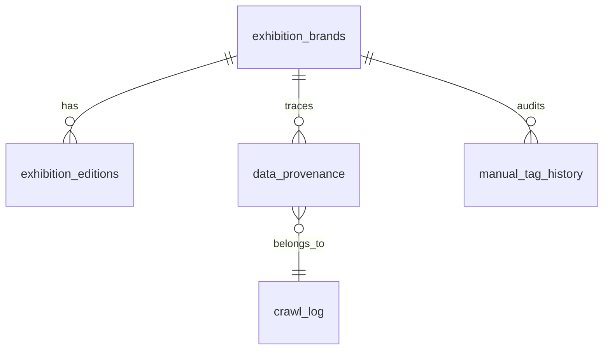

# Exhibition Competitive Dashboard · PRD v1.1（整合版）

**项目代号**: MWLAB-2026  
**版本**: v1.1 · 2026.04.27 · 整合自 v1.0（主PRD）+ v1.1（Phase 3 调整说明）  
**架构师**: Project Commander  
**客户**: BD总监 · 杜塞尔多夫展览上海  
**核心目标**: 帮助总经理快速判断「我们想进入的展会市场」的竞争盘面

---

## §1 项目定位

**一句话定义**: 基于结构化展会数据库的竞争盘面看板，输入一个目标品类，输出该品类的竞争对手 / 潜在伙伴 / 新进入者三维分析视图。

**单一服务对象**: 中国总经理（决策者，非技术）  
**唯一使用场景**: 评估是否进入某个新展会市场  
**明确不做**: 上游产业链指数、下游AI建议、Geckos集成、文字录入交互

---

## §2 As-Is 现状基线（Phase 3 完成后）

| 资产 | 状态 | 价值评估 |
|------|------|---------|
| 手工梳理的品牌主表（93条） | ✅ 已完成 | **金标准模板**，所有字段定义以此为准 |
| 届次表（2条样本） | ✅ 结构已定 | 时序数据模板 |
| 聚展网爬虫脚本 | ✅ 已验证可跑 | 数据源1，仅限国内IP执行 |
| cnexpo.com 测试脚本 | ✅ 已验证可跑 | 数据源2，结构待研究 |
| 品类聚焦：机床 | ✅ 已选定 | 首批数据采集和打标的目标品类 |
| Jufair 数据库 | ✅ 3.4K 条记录（Phase 1-3 累计） | 约40%覆盖率，总量估约8.4K条 |
| 打标 API（`PATCH /api/brands/{brand_id}/tags`）+ Excel 工具（Phase 3b） | ✅ 已完成 | API 可 curl；批量见 `tools/` |
| 前端 UI | ❌ 未启动 | Phase 4 暂缓 |

**关键发现**: 用户的手工表格（93条数据）已经定义了20个品牌字段+21个届次字段，这是PRD字段设计的**唯一权威来源**，不需要重新设计字段，只需要工程化复刻。

---

## §3 数据架构（双层设计）

### 3.1 数据流向

```
┌──────────────────────────────────────────────────────────────┐
│                        数据流向                               │
│                                                               │
│  [jufair爬虫] ──→ raw_jufair                                 │
│                          │                                    │
│  [cnexpo爬虫] ──→ raw_cnexpo ──→ [merge_engine] ──→ 主库    │
│                          │                                    │
│  [手工Excel]  ───────────┘                                   │
└──────────────────────────────────────────────────────────────┘
```

### 3.2 六张表关系



**表间关系描述**：

```
exhibition_brands (品牌表)
│  brand_id PK
│  name_cn, name_en
│  organizer ← 关键字段，主办方
│  industry_l1, industry_l2 ← 人工打标
│  competition_relation ← 人工打标 [是/否]
│  mds_related ← 人工打标 [无/MFC/Reha China/...]
│  strategic_relevance ← 人工打标 [1-5]
│  ma_potential ← 人工打标 [1-5]
│  competitor_group ← 人工打标
│
├──< exhibition_editions (届次表)
│     edition_id PK
│     brand_id FK ──────────────→ exhibition_brands.brand_id
│     year, date_start, date_end
│     venue, city
│     area_sqm ← 核心数字
│     exhibitors_count ← 核心数字
│     visitors_count ← 核心数字
│     status [已举办/即将举办/取消/延期]
│     yoy_trend [上升/平稳/下降] ← 人工打标
│     anomaly_flag ← 人工打标
│     data_source [jufair/cnexpo/官网/手工]
│
├──< data_provenance (溯源表)
│     record_id PK
│     brand_id FK ────────────→ exhibition_brands.brand_id
│     source_site [jufair/cnexpo/manual]
│     source_url
│     raw_payload JSON ← 原始爬取全字段
│     crawled_at
│     crawl_batch_id FK ──────→ crawl_log.batch_id
│
├──< manual_tag_history (打标历史表)
│     id PK
│     brand_id FK ───────────→ exhibition_brands.brand_id
│     field_name ← 被修改的字段名
│     old_value
│     new_value
│     tagged_by ← 操作人
│     tagged_at
│
crawl_log (爬取日志表)               users (用户表)
│  batch_id PK                      │  user_id PK
│  source_site                      │  email
│  crawl_type [full/increment]      │  role [admin/manager/readonly]
│  records_new                      │  is_active
│  records_skipped                  │  last_login
│  status [success/failed/partial]
│  started_at, finished_at
```

### 3.3 表层结构：exhibition_brands（展会品牌表）

主键稳定，变化慢。来自现有品牌表，20个字段全部保留，工程化标准化：

| 字段 | 类型 | 来源 | 备注 |
|------|------|------|------|
| brand_id 🔑 | TEXT | 手工/自动生成 EXPO-XXXX | 主键 |
| name_cn | TEXT | 爬取 | 中文名 |
| name_en | TEXT | 爬取 | 英文名 |
| first_year | INTEGER | 爬取 | 首届年份 |
| organizer | TEXT | 爬取+人工补 | **关键字段** |
| co_organizer | TEXT | 爬取+人工补 | |
| city | TEXT | 爬取 | 常设城市 |
| frequency | TEXT | 爬取 | 年展/双年展 |
| industry_l1 | TEXT | 人工标 | 一级行业（医疗/机械/工业等） |
| industry_l2 | TEXT | 人工标 | 二级行业（机床/数控机床等） |
| **competition_relation** | ENUM | 人工标 | 是/否 — **核心标签** |
| **mds_related** | ENUM | 人工标 | 无/MFC/Reha China 等 — **核心标签** |
| scale_score | INTEGER 1-10 | 人工评 | 展会规模评分 |
| is_international | BOOL | 人工标 | 是/否 |
| is_ufi_certified | BOOL | 人工标 | 是/否 |
| ma_potential | INTEGER 1-5 | 人工评 | 并购潜力 |
| **strategic_relevance** | INTEGER 1-5 | 人工评 | 战略相关度 — **核心标签** |
| competitor_group | TEXT | 人工标 | 竞争对手集团归属 |
| website | TEXT | 爬取 | |
| notes | TEXT | 自由 | |

### 3.4 表层结构：exhibition_editions（届次表）

时序数据，每年新增。21个字段全部保留：

| 字段 | 类型 | 来源 |
|------|------|------|
| edition_id 🔑 | TEXT | EXPO-XXXX-YYYY |
| brand_id | FK | → exhibition_brands |
| edition_num | INTEGER | 届次号 |
| year | INTEGER | 举办年份 |
| date_start, date_end | DATE | 爬取 |
| city, venue | TEXT | 爬取 |
| status | ENUM | 已举办/即将举办/取消/延期 |
| **area_sqm** | INTEGER | 爬取 — **核心字段** |
| **exhibitors_count** | INTEGER | 爬取 — **核心字段** |
| **visitors_count** | INTEGER | 爬取 — **核心字段** |
| overseas_exhibitor_pct | FLOAT | 爬取/估算 |
| booth_price_per_sqm | INTEGER | 爬取 |
| heat_score | INTEGER 1-5 | 人工评 |
| yoy_trend | ENUM | 上升/平稳/下降 |
| anomaly_flag | BOOL | 人工标 |
| data_source | TEXT | jufair/cnexpo/官网/手工 |
| recorded_at | DATETIME | 系统 |
| notes | TEXT | 自由 |

### 3.5 表层结构：四张辅助表

**data_provenance（数据溯源表）** — 新增，未来必需：

| 字段 | 类型 | 说明 |
|------|------|------|
| record_id 🔑 | TEXT | 主键 |
| brand_id | FK | 关联品牌 |
| source_site | ENUM | jufair / cnexpo / manual |
| source_url | TEXT | 原始页面URL |
| raw_payload | JSON | 原始爬取的全字段JSON |
| crawled_at | DATETIME | 爬取时间 |
| crawl_batch_id | TEXT | 批次号，关联到 crawl_log |

**crawl_log / users / manual_tag_history 三张表**：详细 schema 在执行阶段由 Claude Code 展开，本 PRD 只锁定字段范围。

### 3.6 字段来源分类

**自动填充（爬虫产出）**:
- name_cn / name_en / first_year / city / frequency
- website / date_start / date_end / venue
- area_sqm / exhibitors_count / visitors_count
- organizer（爬取，但需人工核验）

**必须人工打标（系统无法推断）**:
- competition_relation → 这个展会是否是竞争对手
- mds_related → 与MDS哪个品牌相关
- strategic_relevance → 战略相关度 1-5
- ma_potential → 并购潜力 1-5
- competitor_group → 归属哪个竞争集团
- industry_l1 / l2 → 行业分类（爬取数据分类混乱，需人工校准）
- yoy_trend → 趋势判断
- anomaly_flag → 本届是否有异常

### 3.7 双源交叉对比逻辑

两个数据源对同一展会的字段冲突时的处理规则（必须在脚本里硬编码）：

| 字段类别 | 优先级规则 |
|---------|-----------|
| 名称、举办时间、地点 | jufair 为准（数据更新更稳定） |
| 展商数、观众数、面积 | **取较大值**，但记录两源差异到 `data_provenance.notes` |
| 主办方 | **两源都保留**，差异时人工兜底 |
| 缺失字段 | 谁有取谁，都没有为 NULL |

---

## §4 更新策略

| 频率 | 类型 | 操作 |
|------|------|------|
| 每周一 | 增量 | 抓取新增展会、届次状态变更（已举办→即将举办等） |
| 每月1日 | 全量 | 重新抓取所有品牌的最新届次数据，对比差异并打异常标记 |
| 每年Q1 | 校准 | 人工复核所有 `competition_relation` / `mds_related` / `strategic_relevance` 标签 |

---

## §5 前端约束（Dashboard层）

**严格规则（来自客户指令）**:
- ❌ 无文字输入
- ✅ 全部点选
- ✅ 不超过 3 个筛选控件
- ❌ UI/UX 设计延后（最终交给 Claude Design）

**3个点选控件已锁定**:
1. **行业筛选** — 单选 industry_l1 → industry_l2 联动
2. **关系筛选** — 多选: 竞争对手 / 潜在伙伴 / 新进入者 / 全部
3. **MDS相关性** — 单选: 全部 / MFC / Reha China / 无

**默认展示三栏**: 竞争对手清单 | 潜在伙伴清单 | 新进入者清单  
**关键数字卡片**: 该品类品牌总数、年度总展商规模、年度总观众规模、近12个月新进入者数量

---

## §6 部署目标

| 维度 | 决策 |
|------|------|
| 域名 | 用户已选定（待告知） |
| 服务器 | 云端部署（具体平台由Claude Code在Phase 3评估后建议） |
| 用户管理 | 内置账号系统，支持总经理+BD团队登录，最多30人 |
| 数据存储 | SQLite（本地开发）→ 云端同步（部署阶段决策） |

---

## §7 Agent 任务分配（分 Phase 执行）

> **铁律**: 每个 Agent 单次执行任务**不超过3个**。Phase 之间客户验收通过后才能进入下一 Phase。

### Phase 1 · 数据采集器（Hermes Agent）— i. 原始范围（Phase 1-3 已完成）

| 任务 | 内容 | 状态 |
|------|------|------|
| 任务1 | 复刻并标准化 jufair_crawler.py，按品类关键词+时间窗口抓取 | ✅ 完成（已产出 3.4K 条） |
| 任务2 | 开发 cnexpo_crawler.py，逻辑结构与 jufair 对齐 | ✅ 完成 |
| 任务3 | 写定时任务调度器 scheduler.py（周一增量/月初全量） | ✅ 完成 |

**原始指令参考**:
> 严格按照顺序执行3个任务，禁止合并、禁止额外发挥。每完成一个任务输出测试报告（抓取条数、字段覆盖率、失败原因），等待人工确认后进入下一个。所有文件命名使用英文蛇形命名法（snake_case）。代码必须能在 Mac Mini 北京办公室节点运行（境外IP无法访问聚展网，已验证返回HTTP 403）。

### Phase 1b · 全集采集（新增 — Phase 3 完成后补充任务）

**背景**: 当前 Jufair 数据库仅 3.4K 条（约 40% 覆盖率），目标为国内 122 页 + 国际 300 页的全量采集，约 8.4K 条。

> **📌 Hermes 全集采集任务（3个，严格串行）**
>
> **任务1**: 执行 Jufair 全量补采
> - 目标：抓取国内（1-122页）+ 国际（1-300页）全部展会，列表页+详情页
> - 去重逻辑：以 `(name_cn, date_start)` 为唯一键，已有的记录跳过（INSERT OR IGNORE）
> - 预期新增：约 5,000 条（已有 3.4K，总量约 8.4K）
> - 输出：`crawl_log` 中写入本次批次，报告新增数/跳过数/失败数
> - **不删除现有数据**，纯增量写入
>
> **任务2**: 探测并执行 cnexpo 全量采集
> - 先爬取 cnexpo 首页+列表页，输出页数统计报告（有多少页、每页多少条）
> - 确认字段覆盖情况（哪些字段能抓到、哪些为空）
> - 执行全量采集，写入 `raw_cnexpo` 表
> - 输出：采集报告，包含字段覆盖率矩阵
>
> **任务3**: 触发合并引擎
> - 调用 `python merge_engine.py --batch <本次批次ID>`
> - 将新采集数据合并进 `exhibition_brands` + `exhibition_editions`
> - 输出：合并报告，标注双源冲突条目数量

---

### Phase 2 · 数据清洗与匹配引擎（Claude Code）— ✅ 已完成

| 任务 | 内容 | 状态 |
|------|------|------|
| 任务1 | 设计并实现 SQLite 完整 Schema（6张表） | ✅ 完成 |
| 任务2 | 实现双源合并引擎 `merge_engine.py`，处理字段冲突 | ✅ 完成 |
| 任务3 | 实现人工打标 API（PATCH /api/brands/{brand_id} + manual_tag_history） | ✅ 完成 |

**原始指令参考**:
> 你是Phase 2的核心大脑。Phase 1的Hermes产出的代码可能存在边界问题（编码、超时、字段缺失），你的合并引擎必须假设原始数据是脏的并优雅处理。三个任务串行执行，每个任务完成后必须输出：(1) Schema/代码文件 (2) 单元测试覆盖率报告 (3) 在用户的93条样本数据上跑通验证。不允许引入除FastAPI、SQLAlchemy、pandas之外的依赖。

---

### Phase 3 · API层与用户系统（Cursor）— i. 原始范围 ✅ 已完成

| 任务 | 内容 | 状态 |
|------|------|------|
| 任务1 | 实现查询API（FastAPI）：`GET /api/dashboard?industry_l2=&relation=&mds=` | ✅ 完成 |
| 任务2 | 实现用户认证系统（邮箱+密码，JWT，3角色，30人上限） | ✅ 完成 |
| 任务3 | Docker化 + 部署方案评估报告 | ✅ 完成 |

### Phase 3b · 补充开发工具（新增 — 依据 Phase 3 结束后调整）

打标 API 已存在但无前端界面，需补充两个工具脚本实现 Excel 批量导入导出。

**当前状态（工程）**: ✅ 已交付（2026-05-06）；单元测试 `tests/test_tagging_tools.py`。

> **📌 Cursor 补充任务（2个）**
>
> **任务1**: 开发 `tools/export_for_tagging.py`
> - 参数: `--industry_l2`（必填）/ `--status untagged|all` / `--output path`
> - 输出: Excel文件，包含 brand_id + 基础信息列 + 空白打标列
> - 打标列设置下拉验证（openpyxl 的 DataValidation）
>
> **任务2**: 开发 `tools/import_tags.py`
> - 参数: `--file` / `--tagger`
> - 逻辑: 读取 Excel 打标列 → 写入 `exhibition_brand` → 写入 `manual_tag_history`
> - 输出: 导入报告（成功 N 条 / 跳过 N 条 / 格式错误 N 条）

---

### Phase 4 · UI/UX设计（Claude Design）— ⏸ 暂缓

**目标**: Phase 1–3 全部验收通过；打标工具链（Phase 3b）已具备。  
**任务范围**: 基于已有 API 设计前端界面。  
**当前状态**: ⏸ 暂缓启动；待全集采集（Phase 1b）与客户排期后再评估。

---

## §8 手工打标实现方案

### 三种方式对比

| 方式 | 适用场景 | 效率 | 推荐度 |
|------|---------|------|--------|
| A. Excel 批量导入 | 批量处理新数据，已有打标模板 | ⭐⭐⭐ | **推荐** |
| B. 直接调用 API | 单条修改、确认具体展会标签 | ⭐⭐ | 过渡用 |
| C. 直接操作 SQLite | API 不可用时的临时应急 | ⭐ | **不推荐** |

### 方式A（推荐）：编辑 Excel → 批量导入

```
第1步：导出待打标数据为Excel
  → python tools/export_for_tagging.py --industry_l2 "机床" --status untagged
  → 生成文件：exports/tagging_batch_YYYYMMDD.xlsx
  → 包含列：brand_id / name_cn / organizer / competition_relation(空)
            / mds_related(空) / strategic_relevance(空)

第2步：在Excel里填写打标列
  → competition_relation 填：是 / 否
  → mds_related 填：无 / MFC / Reha China（或新品牌名）
  → strategic_relevance 填：1 到 5

第3步：导入打标结果
  → python tools/import_tags.py --file exports/tagging_batch_YYYYMMDD.xlsx --tagger "BD总监"
  → 系统自动写入 exhibition_brands 并记录到 manual_tag_history
```

### 方式B（过渡用）：直接调用已有 API

```bash
# 修改竞争关系标签
curl -X PATCH http://localhost:8000/api/brands/EXPO-0001 \
  -H "Authorization: Bearer ***" \
  -H "Content-Type: application/json" \
  -d '{"competition_relation": "是", "strategic_relevance": 5}'

# 查看打标历史
curl http://localhost:8000/api/brands/EXPO-0001/tag-history \
  -H "Authorization: Bearer ***"
```

### 方式C（不推荐）：直接操作 SQLite

```sql
UPDATE exhibition_brands
SET competition_relation = '是',
    strategic_relevance = 5,
    updated_at = CURRENT_TIMESTAMP
WHERE brand_id = 'EXPO-0001';
```

---

## §9 打标优先级策略

全集采集完成后（8,000+ 条），不可能全部一次打标。建议按轮次推进：

| 轮次 | 范围 | 规模 | 操作 |
|------|------|------|------|
| 第1轮 | 机床品类（金数据 93 条） | 93 条 | 验证 import_tags 能正确跑通，确认流程 |
| 第2轮 | 目标品类筛选：industry_l2 IN ('机床','数控机床','工业设备') | 约 200-400 条 | 重点打 competition_relation + strategic_relevance |
| 第3轮 | 其他品类 | 按需 | 进入新品类时再做，不提前。对于 competition_relation='否' 的记录可批量默认不打其他标签 |

---

## §10 验收节点

| Phase | 验收物 | 验收人 | 状态 |
|-------|--------|--------|------|
| 1 | 两个数据源能稳定抓取 100+ 条机床品类展会，字段覆盖率 ≥ 80% | BD总监 | ✅ 已验收 |
| 1b | 全集采集完成，jufair 约 8.4K 条 + cnexpo 全量，合并引擎跑通 | BD总监 | ⏳ 待执行 |
| 2 | 93 条手工样本能 100% 被合并引擎复现，零字段丢失 | BD总监 | ✅ 已验收 |
| 3 | API 在浏览器 Postman 可用，登录系统跑通，部署方案二选一 | BD总监 | ✅ 已验收 |
| 3b | export_for_tagging.py + import_tags.py 两个工具开发完成 | BD总监 | ✅ 已交付（待业务侧抽检） |
| 4 | 前端 Demo 可演示给总经理 | 总经理+BD总监 | ⏸ 暂缓 |

---

## §11 命名规范（强制）

- 所有文件名: `snake_case.py`，禁止中文、空格、连字符
- 数据库表名: `snake_case`，单数（执行阶段由 Claude Code 统一决策）
- 字段名: `snake_case`，英文
- API 端点: `/api/资源-名/动作`，小写连字符

---

## §12 风险登记

| 风险 | 影响 | 缓解措施 |
|------|------|---------|
| 聚展网 IP 白名单（仅大陆IP） | 高 | 爬虫部署在 Mac Mini 北京节点，已验证 |
| cnexpo.com 反爬未知 | 中 | Phase 1b 必须先做反爬探测报告 |
| 字段在两源都缺失 | 中 | 人工打标兜底，已有 93 条样本作金标准 |
| 全集采集 8.4K 条 → 人工打标工作量大 | 中 | §9 分轮次策略，非目标品类不提前打标 |
| 总经理不会用 Dashboard | 高 | Phase 4 设计前必须做用户访谈 |

---

## 附录 A：Phase 1-3 完成物清单

| 产出物 | 所属 Phase | 说明 |
|--------|-----------|------|
| jufair_crawler.py | Phase 1 | 聚展网爬虫，3.4K 条数据 |
| cnexpo_crawler.py | Phase 1 | cnexpo 爬虫 |
| scheduler.py | Phase 1 | 定时任务调度器 |
| schema/init_db.sql | Phase 2 | 6 张表完整 Schema |
| merge_engine.py | Phase 2 | 双源合并引擎 |
| PATCH /api/brands/{brand_id} | Phase 2 | 打标 API |
| FastAPI 查询 API | Phase 3 | Dashboard 数据接口 |
| 用户认证系统 | Phase 3 | JWT + 3 角色 |
| Docker 镜像 | Phase 3 | 容器化部署 |
| tools/export_for_tagging.py · import_tags.py | Phase 3b | Excel 批量打标，`openpyxl` |

---

## 附录 B：待开发物清单

| 待开发物 | 归属 | 优先级 |
|---------|------|--------|
| Jufair 全集补采（国内 122 页 + 国际 300 页） | Phase 1b | 🔴 高 |
| cnexpo 全量探测 + 采集 | Phase 1b | 🔴 高 |
| 全集合并（merge_engine 全量跑通） | Phase 1b | 🔴 高 |
| Dashboard 前端 UI | Phase 4 | 🟢 低（暂缓） |

---

## 附录 C：实现追踪

| Phase | 需求 ID | 状态 | 完成日期 | 验证方式 |
|-------|---------|------|----------|----------|
| 1 | DATA-01 | ✅ 完成 | 2026-04 | `crawlers/jufair_crawler.py` 可运行，3.4K 条数据入库 |
| 1 | DATA-02 | ✅ 完成 | 2026-04 | `crawlers/cnexpo_crawler.py` 可运行 |
| 1 | DATA-03 | ✅ 完成 | 2026-04 | `scheduler.py` + `crawl_log` 表 |
| 2 | DMG-01 | ✅ 完成 | 2026-04 | `merge_engine.py` 通过 93 条金标准 |
| 2 | DMG-02 | ✅ 完成 | 2026-04 | `schema/init_db.sql` 6 表 + 索引 |
| 2 | TAG-01 | ✅ 完成 | 2026-04 | `tag_api.py` + `tests/test_tag_api.py` |
| 3 | DSH-01 | ✅ 完成 | 2026-04 | Dashboard 查询 API |
| 3 | AUT-01 | ✅ 完成 | 2026-04 | JWT 认证 |
| 3 | OPS-01 | ✅ 完成 | 2026-04 | Docker 镜像 |
| 3 | OPS-02 | ✅ 完成 | 2026-04 | OpenAPI 文档 |
| 3 | OPS-03 | ✅ 完成 | 2026-04 | 部署对比表 |
| 3b | EXPORT-TOOL | ✅ 完成 | 2026-05-06 | `tools/export_for_tagging.py` + `tests/test_tagging_tools.py` |
| 3b | IMPORT-TOOL | ✅ 完成 | 2026-05-06 | `tools/import_tags.py` + `tests/test_tagging_tools.py` |
| 1b | FULL-CRAWL | ⏳ 部分 | 2026-05-06 | Jufair 4,046/8,400（IP 封禁中），cnexpo ✅ |
| 1b | CNEXPO-FULL | ✅ 完成 | 2026-05-06 | 4,570 条，229 页全部覆盖 |
| 1b | MERGE-FULL | ✅ 完成 | 2026-05-06 | `merge_engine --batch ALL` +6,326 provenance |
| 4 | UI-POOL | 📋 已规划 | 2026-05-06 | 7 plans in 4 waves，待执行 |

---

## 附录 D：完成要素检查清单

- [x] 双源爬虫可用（Jufair + cnexpo）
- [x] 6 表 Schema 完整（SQLite + PostgreSQL 双版本）
- [x] 合并引擎通过 93 条金标准验证
- [x] 打标 API + Excel 批量工具完整
- [x] Dashboard 查询 API + JWT 认证
- [x] Docker 化 + OpenAPI 文档
- [x] cnexpo 全量采集完成（4,570 条）
- [ ] Jufair 全量采集（4,046/8,400，等待 IP 解封）
- [ ] Phase 4 前端架构执行（7 plans 待执行）
- [ ] 生产部署（Cloudflare Workers + Supabase）

---

*PRD v1.1（整合版）· ECD-2026 · 2026.04.27 · CONFIDENTIAL*  
*整合自: PRD v1.0（主架构）+ Adjustment v1.1（Phase 3 调整说明）*  
*最后更新: 2026-05-07 — 项目整合清理，增加实现追踪与完成要素*
