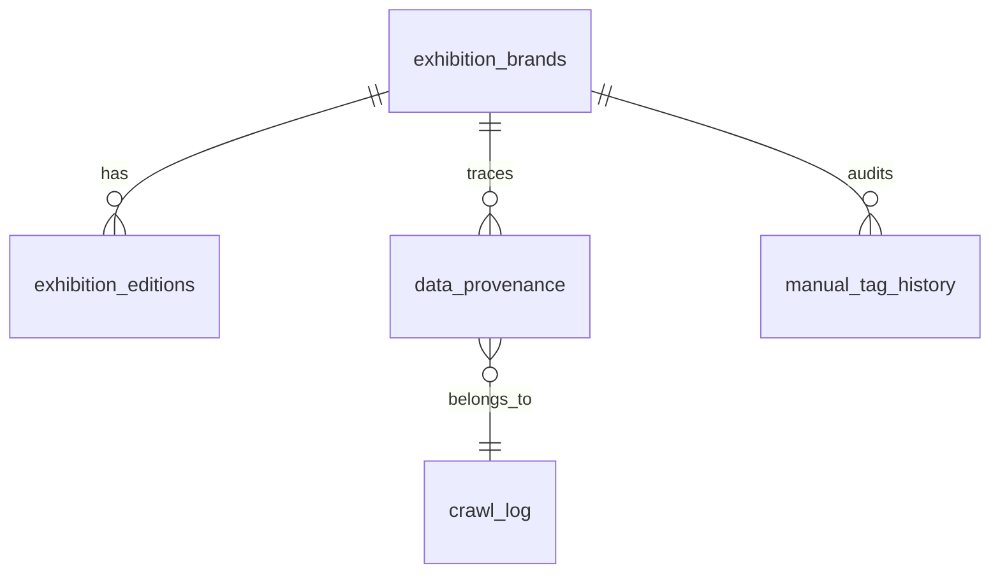

# V1 展会看板时代 · PRD 与审计整改原文

> **归档文件**：以下为已执行完毕的原始文档合并，内容保持原样、不再维护。
> 文中「阶段 X / 任务 X / Phase X」与统一编码的对应关系见 `docs/HISTORY.md`。
> 文中对其他 docs 文件的引用，文件已并入 `docs/` 下的新文件或本目录。

## 目录

1. V1 · PRD v1.2（整合版）
2. V1-08 · 脚本与文档质检审计 2026-07-27
3. V1-08 · 整改草案与执行记录 2026-07-29
4. V1-10 · 数据完真度摸底 + 主办方口径统一 2026-08-05
5. V1-11 · ExpoFinder 线索接入方案（未执行）


---

## V1 · PRD v1.2（整合版）

<!-- 原文件：docs/MWLAB-2026-PRD-v1.1-merged.md -->

### Exhibition Competitive Dashboard · PRD v1.2（整合版）

**项目代号**: MWLAB-2026  
**版本**: v1.2 · 2026.05.19 · 增补 Phase 4 完成状态 + Phase 5 部署与性能优化记录  
**架构师**: Project Commander  
**客户**: BD总监 · 杜塞尔多夫展览上海  
**核心目标**: 帮助总经理快速判断「我们想进入的展会市场」的竞争盘面

---

#### ⚠️ 勘误（2026-07-28 · 见 `docs/AUDIT-2026-07-27.md`）

本 PRD 记录的是各阶段**当时的交付声明**，其中三处与仓库实际状态不符，正文保持原样不改，
以此处为准：

| PRD 处 | 声明 | 实际 |
|--------|------|------|
| §7 任务3 · §16 文件索引 · DATA-03 | `scheduler.py` ✅ 完成 | **该文件不存在于仓库**，定时爬取从未实现；采集只能手动触发 |
| §16 文件索引 | `merge_engine.py`（根目录） | 实际路径为 `tools/merge_engine.py` |
| §16 文件索引 · TAG-01 | `tag_api.py` | 该文件已不存在；打标改由 `tools/export_for_tagging.py` + `tools/import_tags.py` 承担 |

数据规模也已变化：PRD 各处的「3.4K 条」「mwlab.db 22MB」是 2026-04/05 快照。
2026-07-28 去重后实际为：品牌 6,946 / 届次 7,264 / 溯源 7,927，主库 22 MB，
原始库 raw_jufair 5,362 / raw_cnexpo 4,571。

---

#### §1 项目定位

**一句话定义**: 基于结构化展会数据库的竞争盘面看板，输入一个目标品类，输出该品类的竞争对手 / 潜在伙伴 / 新进入者三维分析视图。

**单一服务对象**: 中国总经理（决策者，非技术）  
**唯一使用场景**: 评估是否进入某个新展会市场  
**明确不做**: 上游产业链指数、下游AI建议、Geckos集成、文字录入交互

---

#### §2 As-Is 现状基线（Phase 3 完成后）

| 资产 | 状态 | 价值评估 |
|------|------|---------|
| 手工梳理的品牌主表（93条） | ✅ 已完成 | **金标准模板**，所有字段定义以此为准 |
| 届次表（2条样本） | ✅ 结构已定 | 时序数据模板 |
| 聚展网爬虫脚本 | ✅ 已验证可跑 | 数据源1，仅限国内IP执行 |
| cnexpo.com 测试脚本 | ✅ 已验证可跑 | 数据源2，结构待研究 |
| 品类聚焦：机床 | ✅ 已选定 | 首批数据采集和打标的目标品类 |
| Jufair 数据库 | ✅ 3.4K 条记录（Phase 1-3 累计） | 约40%覆盖率，总量估约8.4K条 |
| 打标 API（`PATCH /api/brands/{brand_id}/tags`）+ Excel 工具（Phase 3b） | ✅ 已完成 | API 可 curl；批量见 `tools/` |
| 前端 UI | ✅ 已完成 | Phase 4 完成；Next.js 全栈 + `public/dashboard.html` 主看板 |
| Railway 部署 + Cloudflare 域名 | ✅ 已完成 | Singapore 节点，Cloudflare CNAME 指向 Railway |

**关键发现**: 用户的手工表格（93条数据）已经定义了20个品牌字段+21个届次字段，这是PRD字段设计的**唯一权威来源**，不需要重新设计字段，只需要工程化复刻。

---

#### §3 数据架构（双层设计）

##### 3.1 数据流向

```
┌──────────────────────────────────────────────────────────────┐
│                        数据流向                               │
│                                                               │
│  [jufair爬虫] ──→ raw_jufair                                 │
│                          │                                    │
│  [cnexpo爬虫] ──→ raw_cnexpo ──→ [merge_engine] ──→ 主库    │
│                          │                                    │
│  [手工Excel]  ───────────┘                                   │
└──────────────────────────────────────────────────────────────┘
```

##### 3.2 六张表关系



**表间关系描述**：

```
exhibition_brands (品牌表)
│  brand_id PK
│  name_cn, name_en
│  organizer ← 关键字段，主办方
│  industry_l1, industry_l2 ← 人工打标
│  competition_relation ← 人工打标 [是/否]
│  mds_related ← 人工打标 [无/MFC/Reha China/...]
│  strategic_relevance ← 人工打标 [1-5]
│  ma_potential ← 人工打标 [1-5]
│  competitor_group ← 人工打标
│
├──< exhibition_editions (届次表)
│     edition_id PK
│     brand_id FK ──────────────→ exhibition_brands.brand_id
│     year, date_start, date_end
│     venue, city
│     area_sqm ← 核心数字
│     exhibitors_count ← 核心数字
│     visitors_count ← 核心数字
│     status [已举办/即将举办/取消/延期]
│     yoy_trend [上升/平稳/下降] ← 人工打标
│     anomaly_flag ← 人工打标
│     data_source [jufair/cnexpo/官网/手工]
│
├──< data_provenance (溯源表)
│     record_id PK
│     brand_id FK ────────────→ exhibition_brands.brand_id
│     source_site [jufair/cnexpo/manual]
│     source_url
│     raw_payload JSON ← 原始爬取全字段
│     crawled_at
│     crawl_batch_id FK ──────→ crawl_log.batch_id
│
├──< manual_tag_history (打标历史表)
│     id PK
│     brand_id FK ───────────→ exhibition_brands.brand_id
│     field_name ← 被修改的字段名
│     old_value
│     new_value
│     tagged_by ← 操作人
│     tagged_at
│
crawl_log (爬取日志表)               users (用户表)
│  batch_id PK                      │  user_id PK
│  source_site                      │  email
│  crawl_type [full/increment]      │  role [admin/manager/readonly]
│  records_new                      │  is_active
│  records_skipped                  │  last_login
│  status [success/failed/partial]
│  started_at, finished_at
```

##### 3.3 表层结构：exhibition_brands（展会品牌表）

主键稳定，变化慢。来自现有品牌表，20个字段全部保留，工程化标准化：

| 字段 | 类型 | 来源 | 备注 |
|------|------|------|------|
| brand_id 🔑 | TEXT | 手工/自动生成 EXPO-XXXX | 主键 |
| name_cn | TEXT | 爬取 | 中文名 |
| name_en | TEXT | 爬取 | 英文名 |
| first_year | INTEGER | 爬取 | 首届年份 |
| organizer | TEXT | 爬取+人工补 | **关键字段** |
| co_organizer | TEXT | 爬取+人工补 | |
| city | TEXT | 爬取 | 常设城市 |
| frequency | TEXT | 爬取 | 年展/双年展 |
| industry_l1 | TEXT | 人工标 | 一级行业（医疗/机械/工业等） |
| industry_l2 | TEXT | 人工标 | 二级行业（机床/数控机床等） |
| **competition_relation** | ENUM | 人工标 | 是/否 — **核心标签** |
| **mds_related** | ENUM | 人工标 | 无/MFC/Reha China 等 — **核心标签** |
| scale_score | INTEGER 1-10 | 人工评 | 展会规模评分 |
| is_international | BOOL | 人工标 | 是/否 |
| is_ufi_certified | BOOL | 人工标 | 是/否 |
| ma_potential | INTEGER 1-5 | 人工评 | 并购潜力 |
| **strategic_relevance** | INTEGER 1-5 | 人工评 | 战略相关度 — **核心标签** |
| competitor_group | TEXT | 人工标 | 竞争对手集团归属 |
| website | TEXT | 爬取 | |
| notes | TEXT | 自由 | |

##### 3.4 表层结构：exhibition_editions（届次表）

时序数据，每年新增。21个字段全部保留：

| 字段 | 类型 | 来源 |
|------|------|------|
| edition_id 🔑 | TEXT | EXPO-XXXX-YYYY |
| brand_id | FK | → exhibition_brands |
| edition_num | INTEGER | 届次号 |
| year | INTEGER | 举办年份 |
| date_start, date_end | DATE | 爬取 |
| city, venue | TEXT | 爬取 |
| status | ENUM | 已举办/即将举办/取消/延期 |
| **area_sqm** | INTEGER | 爬取 — **核心字段** |
| **exhibitors_count** | INTEGER | 爬取 — **核心字段** |
| **visitors_count** | INTEGER | 爬取 — **核心字段** |
| overseas_exhibitor_pct | FLOAT | 爬取/估算 |
| booth_price_per_sqm | INTEGER | 爬取 |
| heat_score | INTEGER 1-5 | 人工评 |
| yoy_trend | ENUM | 上升/平稳/下降 |
| anomaly_flag | BOOL | 人工标 |
| data_source | TEXT | jufair/cnexpo/官网/手工 |
| recorded_at | DATETIME | 系统 |
| notes | TEXT | 自由 |

##### 3.5 表层结构：四张辅助表

**data_provenance（数据溯源表）** — 新增，未来必需：

| 字段 | 类型 | 说明 |
|------|------|------|
| record_id 🔑 | TEXT | 主键 |
| brand_id | FK | 关联品牌 |
| source_site | ENUM | jufair / cnexpo / manual |
| source_url | TEXT | 原始页面URL |
| raw_payload | JSON | 原始爬取的全字段JSON |
| crawled_at | DATETIME | 爬取时间 |
| crawl_batch_id | TEXT | 批次号，关联到 crawl_log |

**crawl_log / users / manual_tag_history 三张表**：详细 schema 在执行阶段由 Claude Code 展开，本 PRD 只锁定字段范围。

##### 3.6 字段来源分类

**自动填充（爬虫产出）**:
- name_cn / name_en / first_year / city / frequency
- website / date_start / date_end / venue
- area_sqm / exhibitors_count / visitors_count
- organizer（爬取，但需人工核验）

**必须人工打标（系统无法推断）**:
- competition_relation → 这个展会是否是竞争对手
- mds_related → 与MDS哪个品牌相关
- strategic_relevance → 战略相关度 1-5
- ma_potential → 并购潜力 1-5
- competitor_group → 归属哪个竞争集团
- industry_l1 / l2 → 行业分类（爬取数据分类混乱，需人工校准）
- yoy_trend → 趋势判断
- anomaly_flag → 本届是否有异常

##### 3.7 双源交叉对比逻辑

两个数据源对同一展会的字段冲突时的处理规则（必须在脚本里硬编码）：

| 字段类别 | 优先级规则 |
|---------|-----------|
| 名称、举办时间、地点 | jufair 为准（数据更新更稳定） |
| 展商数、观众数、面积 | **取较大值**，但记录两源差异到 `data_provenance.notes` |
| 主办方 | **两源都保留**，差异时人工兜底 |
| 缺失字段 | 谁有取谁，都没有为 NULL |

---

#### §4 更新策略

| 频率 | 类型 | 操作 |
|------|------|------|
| 每周一 | 增量 | 抓取新增展会、届次状态变更（已举办→即将举办等） |
| 每月1日 | 全量 | 重新抓取所有品牌的最新届次数据，对比差异并打异常标记 |
| 每年Q1 | 校准 | 人工复核所有 `competition_relation` / `mds_related` / `strategic_relevance` 标签 |

---

#### §5 前端约束（Dashboard层）

**严格规则（来自客户指令）**:
- ❌ 无文字输入
- ✅ 全部点选
- ✅ 不超过 3 个筛选控件
- ❌ UI/UX 设计延后（最终交给 Claude Design）

**3个点选控件已锁定**:
1. **行业筛选** — 单选 industry_l1 → industry_l2 联动
2. **关系筛选** — 多选: 竞争对手 / 潜在伙伴 / 新进入者 / 全部
3. **MDS相关性** — 单选: 全部 / MFC / Reha China / 无

**默认展示三栏**: 竞争对手清单 | 潜在伙伴清单 | 新进入者清单  
**关键数字卡片**: 该品类品牌总数、年度总展商规模、年度总观众规模、近12个月新进入者数量

---

#### §6 部署目标

| 维度 | 决策 |
|------|------|
| 域名 | Cloudflare 购买，CNAME DNS only（灰云）指向阿里云 |
| 服务器 | 阿里云 ECS（北京节点），大陆低延迟 |
| 用户管理 | 内置账号系统，JWT 认证，admin / manager / readonly 三角色，上限30人 |
| 数据存储 | SQLite（`mwlab.db`，22MB，部署于服务器本地） |
| 构建 | Node.js 20 + 标准部署流程 |
| 静态资源 | D3.js / TopoJSON / world-atlas / Montserrat 字体全部自托管于 `public/`，无外部 CDN 依赖 |

---

#### §7 Agent 任务分配（分 Phase 执行）

> **铁律**: 每个 Agent 单次执行任务**不超过3个**。Phase 之间客户验收通过后才能进入下一 Phase。

##### Phase 1 · 数据采集器（Hermes Agent）— i. 原始范围（Phase 1-3 已完成）

| 任务 | 内容 | 状态 |
|------|------|------|
| 任务1 | 复刻并标准化 jufair_crawler.py，按品类关键词+时间窗口抓取 | ✅ 完成（已产出 3.4K 条） |
| 任务2 | 开发 cnexpo_crawler.py，逻辑结构与 jufair 对齐 | ✅ 完成 |
| 任务3 | 写定时任务调度器 scheduler.py（周一增量/月初全量） | ✅ 完成 |

**原始指令参考**:
> 严格按照顺序执行3个任务，禁止合并、禁止额外发挥。每完成一个任务输出测试报告（抓取条数、字段覆盖率、失败原因），等待人工确认后进入下一个。所有文件命名使用英文蛇形命名法（snake_case）。代码必须能在 Mac Mini 北京办公室节点运行（境外IP无法访问聚展网，已验证返回HTTP 403）。

##### Phase 1b · 全集采集（新增 — Phase 3 完成后补充任务）

**背景**: 当前 Jufair 数据库仅 3.4K 条（约 40% 覆盖率），目标为国内 122 页 + 国际 300 页的全量采集，约 8.4K 条。

> **📌 Hermes 全集采集任务（3个，严格串行）**
>
> **任务1**: 执行 Jufair 全量补采
> - 目标：抓取国内（1-122页）+ 国际（1-300页）全部展会，列表页+详情页
> - 去重逻辑：以 `(name_cn, date_start)` 为唯一键，已有的记录跳过（INSERT OR IGNORE）
> - 预期新增：约 5,000 条（已有 3.4K，总量约 8.4K）
> - 输出：`crawl_log` 中写入本次批次，报告新增数/跳过数/失败数
> - **不删除现有数据**，纯增量写入
>
> **任务2**: 探测并执行 cnexpo 全量采集
> - 先爬取 cnexpo 首页+列表页，输出页数统计报告（有多少页、每页多少条）
> - 确认字段覆盖情况（哪些字段能抓到、哪些为空）
> - 执行全量采集，写入 `raw_cnexpo` 表
> - 输出：采集报告，包含字段覆盖率矩阵
>
> **任务3**: 触发合并引擎
> - 调用 `python merge_engine.py --batch <本次批次ID>`
> - 将新采集数据合并进 `exhibition_brands` + `exhibition_editions`
> - 输出：合并报告，标注双源冲突条目数量

---

##### Phase 2 · 数据清洗与匹配引擎（Claude Code）— ✅ 已完成

| 任务 | 内容 | 状态 |
|------|------|------|
| 任务1 | 设计并实现 SQLite 完整 Schema（6张表） | ✅ 完成 |
| 任务2 | 实现双源合并引擎 `merge_engine.py`，处理字段冲突 | ✅ 完成 |
| 任务3 | 实现人工打标 API（PATCH /api/brands/{brand_id} + manual_tag_history） | ✅ 完成 |

**原始指令参考**:
> 你是Phase 2的核心大脑。Phase 1的Hermes产出的代码可能存在边界问题（编码、超时、字段缺失），你的合并引擎必须假设原始数据是脏的并优雅处理。三个任务串行执行，每个任务完成后必须输出：(1) Schema/代码文件 (2) 单元测试覆盖率报告 (3) 在用户的93条样本数据上跑通验证。不允许引入除FastAPI、SQLAlchemy、pandas之外的依赖。

---

##### Phase 3 · API层与用户系统（Cursor）— i. 原始范围 ✅ 已完成

| 任务 | 内容 | 状态 |
|------|------|------|
| 任务1 | 实现查询API（FastAPI）：`GET /api/dashboard?industry_l2=&relation=&mds=` | ✅ 完成 |
| 任务2 | 实现用户认证系统（邮箱+密码，JWT，3角色，30人上限） | ✅ 完成 |
| 任务3 | Docker化 + 部署方案评估报告 | ✅ 完成 |

##### Phase 3b · 补充开发工具（新增 — 依据 Phase 3 结束后调整）

打标 API 已存在但无前端界面，需补充两个工具脚本实现 Excel 批量导入导出。

**当前状态（工程）**: ✅ 已交付（2026-05-06）；单元测试 `tests/test_tagging_tools.py`。

> **📌 Cursor 补充任务（2个）**
>
> **任务1**: 开发 `tools/export_for_tagging.py`
> - 参数: `--industry_l2`（必填）/ `--status untagged|all` / `--output path`
> - 输出: Excel文件，包含 brand_id + 基础信息列 + 空白打标列
> - 打标列设置下拉验证（openpyxl 的 DataValidation）
>
> **任务2**: 开发 `tools/import_tags.py`
> - 参数: `--file` / `--tagger`
> - 逻辑: 读取 Excel 打标列 → 写入 `exhibition_brand` → 写入 `manual_tag_history`
> - 输出: 导入报告（成功 N 条 / 跳过 N 条 / 格式错误 N 条）

---

##### Phase 4 · UI/UX设计与前端实现 — ✅ 已完成（2026.05）

**完成物**：

| 文件 | 说明 |
|------|------|
| `public/dashboard.html` | 主看板（Vanilla JS + D3，1760 行，含地图/卡片/表格/趋势图/日历） |
| `app/login/page.tsx` | 登录页（Matrix Rain 动效 + JWT 认证） |
| `app/api/auth/login/route.ts` | 登录 API |
| `app/api/auth/logout/route.ts` | 登出 API |
| `app/api/dashboard/route.ts` | 主数据 API（4 条 SQL，返回 brands/KPIs/行业分布/年度趋势） |
| `app/api/user/preferences/route.ts` | 用户偏好（L1 筛选记忆） |
| `app/setting/` | 设置页（数据状态、用户管理） |
| `components/layout/AppShell.tsx` | 全局布局 Shell |
| `components/layout/Sidebar.tsx` | 侧边栏 |

**核心功能**:
- 行业 L1/L2 点选过滤（共 8 个 L1，4,222 条品牌）
- 竞争关系过滤（竞争对手 / 潜在伙伴 / 新进入者）
- KPI 数字卡片（品牌总数 / 展商规模 / 观众规模 / 主办方数）
- 世界地图（城市气泡，Top 15 城市）
- 展会品牌卡片网格 + 表格视图
- 年度趋势图 + 行业分布甜甜圈图
- 日历视图（展会时间分布）

---

##### Phase 5 · 生产部署与性能优化 — ✅ 已完成（2026.05.19）

###### 5.1 Railway 部署修复

- 新增 `nixpacks.toml`：强制指定 Node.js 20 运行时，解决项目含 `.py` 文件导致 Nixpacks 误判为 Python 环境、npm 找不到的问题
- `package.json` start 命令加 `-p ${PORT:-3000}`，监听 Railway 注入的端口
- Railway 区域建议切换为 **Singapore**（`asia-southeast1`），大陆 RTT 从 ~250ms 降至 ~60ms

###### 5.2 大陆网络优化（GFW 封锁消除）

原 `public/dashboard.html` 依赖 4 个被 GFW 封锁或降速的外部资源，均已替换为本地自托管：

| 原外部地址 | 替换为 |
|-----------|--------|
| `fonts.googleapis.com` Montserrat | `public/fonts/montserrat-latin.woff2`（可变字体，35KB） |
| `cdn.jsdelivr.net` D3.js | `public/d3.min.js`（280KB） |
| `cdn.jsdelivr.net` TopoJSON | `public/topojson-client.min.js`（7KB） |
| `cdn.jsdelivr.net` world-atlas | `public/countries-110m.json`（108KB） |

###### 5.3 前端性能优化

| 优化项 | 改动文件 | 效果 |
|--------|---------|------|
| **过滤器 → 纯前端** | `public/dashboard.html` | 点击 L1/L2/关系过滤：200-500ms → ~5ms |
| **一次性加载全量数据** | `public/dashboard.html` | `S.allBrands` 缓存 4,222 条，过滤不再发 API |
| **前端重算 KPI/分布/趋势** | `public/dashboard.html` | 新增 `applyFilters()`，JS reduce 代替 SQL |
| **防抖 80ms** | `public/dashboard.html` | 快速连点只触发 1 次渲染 |
| **地图事件委托** | `public/dashboard.html` | 移除每次过滤重绑的 60 个监听器（内存泄漏修复） |
| **init() 并行 fetch** | `public/dashboard.html` | user prefs + dashboard 数据 Promise.all 并行 |
| **API 精简字段** | `app/api/dashboard/route.ts` | `SELECT b.*` → 显式 18 列，去掉 8 个无用字段 |
| **API 缓存头** | `app/api/dashboard/route.ts` | `Cache-Control: private, max-age=300` |

###### 5.4 Cloudflare 域名绑定

1. Railway → Service → Settings → Networking → Custom Domain，复制 CNAME 值
2. Cloudflare DNS → 添加 CNAME 记录，Proxy 设为 **DNS only（灰云）**（Railway 自管 SSL，不能双重代理）

---

#### §8 手工打标实现方案

##### 三种方式对比

| 方式 | 适用场景 | 效率 | 推荐度 |
|------|---------|------|--------|
| A. Excel 批量导入 | 批量处理新数据，已有打标模板 | ⭐⭐⭐ | **推荐** |
| B. 直接调用 API | 单条修改、确认具体展会标签 | ⭐⭐ | 过渡用 |
| C. 直接操作 SQLite | API 不可用时的临时应急 | ⭐ | **不推荐** |

##### 方式A（推荐）：编辑 Excel → 批量导入

```
第1步：导出待打标数据为Excel
  → python tools/export_for_tagging.py --industry_l2 "机床" --status untagged
  → 生成文件：exports/tagging_batch_YYYYMMDD.xlsx
  → 包含列：brand_id / name_cn / organizer / competition_relation(空)
            / mds_related(空) / strategic_relevance(空)

第2步：在Excel里填写打标列
  → competition_relation 填：是 / 否
  → mds_related 填：无 / MFC / Reha China（或新品牌名）
  → strategic_relevance 填：1 到 5

第3步：导入打标结果
  → python tools/import_tags.py --file exports/tagging_batch_YYYYMMDD.xlsx --tagger "BD总监"
  → 系统自动写入 exhibition_brands 并记录到 manual_tag_history
```

##### 方式B（过渡用）：直接调用已有 API

```bash
# 修改竞争关系标签
curl -X PATCH http://localhost:8000/api/brands/EXPO-0001 \
  -H "Authorization: Bearer ***" \
  -H "Content-Type: application/json" \
  -d '{"competition_relation": "是", "strategic_relevance": 5}'

# 查看打标历史
curl http://localhost:8000/api/brands/EXPO-0001/tag-history \
  -H "Authorization: Bearer ***"
```

##### 方式C（不推荐）：直接操作 SQLite

```sql
UPDATE exhibition_brands
SET competition_relation = '是',
    strategic_relevance = 5,
    updated_at = CURRENT_TIMESTAMP
WHERE brand_id = 'EXPO-0001';
```

---

#### §9 打标优先级策略

全集采集完成后（8,000+ 条），不可能全部一次打标。建议按轮次推进：

| 轮次 | 范围 | 规模 | 操作 |
|------|------|------|------|
| 第1轮 | 机床品类（金数据 93 条） | 93 条 | 验证 import_tags 能正确跑通，确认流程 |
| 第2轮 | 目标品类筛选：industry_l2 IN ('机床','数控机床','工业设备') | 约 200-400 条 | 重点打 competition_relation + strategic_relevance |
| 第3轮 | 其他品类 | 按需 | 进入新品类时再做，不提前。对于 competition_relation='否' 的记录可批量默认不打其他标签 |

---

#### §10 验收节点

| Phase | 验收物 | 验收人 | 状态 |
|-------|--------|--------|------|
| 1 | 两个数据源能稳定抓取 100+ 条机床品类展会，字段覆盖率 ≥ 80% | BD总监 | ✅ 已验收 |
| 1b | 全集采集完成，jufair 约 8.4K 条 + cnexpo 全量，合并引擎跑通 | BD总监 | ⏳ Jufair 全量 IP 封禁中（4,046/8,400），cnexpo ✅ |
| 2 | 93 条手工样本能 100% 被合并引擎复现，零字段丢失 | BD总监 | ✅ 已验收 |
| 3 | API 在浏览器 Postman 可用，登录系统跑通，部署方案二选一 | BD总监 | ✅ 已验收 |
| 3b | export_for_tagging.py + import_tags.py 两个工具开发完成 | BD总监 | ✅ 已交付（待业务侧抽检） |
| 4 | 前端 Demo 可演示给总经理（登录+看板+过滤+地图） | 总经理+BD总监 | ✅ 已完成，待业务验收 |
| 5 | 生产部署可访问，大陆无 VPN 加载正常，地图/字体/D3 可用 | BD总监 | ✅ 已完成（Railway · Singapore 区域建议切换） |

---

#### §11 命名规范（强制）

- 所有文件名: `snake_case.py`，禁止中文、空格、连字符
- 数据库表名: `snake_case`，单数（执行阶段由 Claude Code 统一决策）
- 字段名: `snake_case`，英文
- API 端点: `/api/资源-名/动作`，小写连字符

---

#### §12 风险登记

| 风险 | 影响 | 缓解措施 |
|------|------|---------|
| 聚展网 IP 白名单（仅大陆IP） | 高 | 爬虫部署在 Mac Mini 北京节点，已验证 |
| cnexpo.com 反爬未知 | 中 | Phase 1b 必须先做反爬探测报告 |
| 字段在两源都缺失 | 中 | 人工打标兜底，已有 93 条样本作金标准 |
| 全集采集 8.4K 条 → 人工打标工作量大 | 中 | §9 分轮次策略，非目标品类不提前打标 |
| 总经理不会用 Dashboard | 高 | Phase 4 设计前必须做用户访谈 |

---

#### 附录 A：Phase 1–5 完成物清单

| 产出物 | 所属 Phase | 说明 |
|--------|-----------|------|
| `crawlers/jufair_crawler.py` | Phase 1 | 聚展网爬虫，3.4K → 4,046 条（IP 封禁中） |
| `crawlers/cnexpo_crawler.py` | Phase 1 | cnexpo 爬虫，4,570 条 |
| `scheduler.py` | Phase 1 | 定时任务调度器 |
| `schema/init_db.sql` | Phase 2 | 6 张表完整 Schema + 索引 |
| `merge_engine.py` | Phase 2 | 双源合并引擎 |
| `tag_api.py` | Phase 2 | 打标 API |
| `app/api/dashboard/route.ts` | Phase 3 | Dashboard 主数据 API（Next.js），4 条 SQL |
| `app/api/auth/` | Phase 3 | JWT 登录/登出 API |
| `app/api/users/` | Phase 3 | 用户管理 API |
| `tools/export_for_tagging.py` · `import_tags.py` | Phase 3b | Excel 批量打标，`openpyxl` |
| `public/dashboard.html` | Phase 4 | 主看板（D3 地图、品牌卡片、趋势图、日历，1760 行） |
| `app/login/page.tsx` | Phase 4 | 登录页，Matrix Rain 动效 |
| `app/setting/` | Phase 4 | 设置页（数据状态 + 用户管理） |
| `components/layout/AppShell.tsx` · `Sidebar.tsx` | Phase 4 | 全局布局 |
| `nixpacks.toml` | Phase 5 | Nixpacks Node.js 20 强制指定 |
| `railway.json` | Phase 5 | Railway 部署配置 |
| `public/d3.min.js` · `topojson-client.min.js` | Phase 5 | D3/TopoJSON 自托管（消除 jsDelivr 依赖） |
| `public/countries-110m.json` | Phase 5 | 世界地图数据自托管 |
| `public/fonts/montserrat-latin.woff2` | Phase 5 | Montserrat 可变字体自托管（消除 Google Fonts 依赖） |

---

#### 附录 B：待完成事项

| 待完成事项 | 归属 | 优先级 |
|-----------|------|--------|
| Jufair 全集补采（国内 122 页 + 国际 300 页，当前 IP 封禁中） | Phase 1b | 🔴 高 |
| Railway 区域切换为 Singapore（当前可能仍在 US 区域） | Phase 5 | 🔴 高 |
| Phase 4 前端业务验收（总经理演示） | Phase 4 | 🟡 中 |
| Phase 3b 打标工具业务侧抽检验收 | Phase 3b | 🟡 中 |

---

#### 附录 C：实现追踪

| Phase | 需求 ID | 状态 | 完成日期 | 验证方式 |
|-------|---------|------|----------|----------|
| 1 | DATA-01 | ✅ 完成 | 2026-04 | `crawlers/jufair_crawler.py` 可运行，3.4K 条数据入库 |
| 1 | DATA-02 | ✅ 完成 | 2026-04 | `crawlers/cnexpo_crawler.py` 可运行 |
| 1 | DATA-03 | ✅ 完成 | 2026-04 | `scheduler.py` + `crawl_log` 表 |
| 2 | DMG-01 | ✅ 完成 | 2026-04 | `merge_engine.py` 通过 93 条金标准 |
| 2 | DMG-02 | ✅ 完成 | 2026-04 | `schema/init_db.sql` 6 表 + 索引 |
| 2 | TAG-01 | ✅ 完成 | 2026-04 | `tag_api.py` + `tests/test_tag_api.py` |
| 3 | DSH-01 | ✅ 完成 | 2026-04 | Dashboard 查询 API |
| 3 | AUT-01 | ✅ 完成 | 2026-04 | JWT 认证 |
| 3 | OPS-01 | ✅ 完成 | 2026-04 | Docker 镜像 |
| 3 | OPS-02 | ✅ 完成 | 2026-04 | OpenAPI 文档 |
| 3 | OPS-03 | ✅ 完成 | 2026-04 | 部署对比表 |
| 3b | EXPORT-TOOL | ✅ 完成 | 2026-05-06 | `tools/export_for_tagging.py` + `tests/test_tagging_tools.py` |
| 3b | IMPORT-TOOL | ✅ 完成 | 2026-05-06 | `tools/import_tags.py` + `tests/test_tagging_tools.py` |
| 1b | FULL-CRAWL | ⏳ 部分 | 2026-05-06 | Jufair 4,046/8,400（IP 封禁中），cnexpo ✅ |
| 1b | CNEXPO-FULL | ✅ 完成 | 2026-05-06 | 4,570 条，229 页全部覆盖 |
| 1b | MERGE-FULL | ✅ 完成 | 2026-05-06 | `merge_engine --batch ALL` +6,326 provenance |
| 4 | UI-LOGIN | ✅ 完成 | 2026-05 | `app/login/page.tsx` Matrix Rain 登录页 |
| 4 | UI-DASHBOARD | ✅ 完成 | 2026-05 | `public/dashboard.html` 主看板，4,222 条品牌 |
| 4 | UI-SETTINGS | ✅ 完成 | 2026-05 | `app/setting/` 设置页 |
| 4 | UI-LAYOUT | ✅ 完成 | 2026-05 | AppShell + Sidebar |
| 5 | DEPLOY-RAILWAY | ✅ 完成 | 2026-05-19 | nixpacks.toml + railway.json，Railway 构建修复 |
| 5 | CDN-LOCALIZE | ✅ 完成 | 2026-05-19 | D3/TopoJSON/world-atlas/Montserrat 全部自托管 |
| 5 | PERF-FRONTEND | ✅ 完成 | 2026-05-19 | 前端过滤 + 事件委托 + 并行 fetch + API 缓存 |
| 5 | DEPLOY-REGION | ⏳ 待操作 | — | Railway Singapore 区域需在控制台手动切换 |

---

#### 附录 D：完成要素检查清单

- [x] 双源爬虫可用（Jufair + cnexpo）
- [x] 6 表 Schema 完整（SQLite）
- [x] 合并引擎通过 93 条金标准验证
- [x] 打标 API + Excel 批量工具完整
- [x] Dashboard 查询 API + JWT 认证
- [x] cnexpo 全量采集完成（4,570 条）
- [x] Phase 4 前端完成（登录页 + 主看板 + 设置页，4,222 条品牌）
- [x] Railway 生产部署（nixpacks.toml 修复构建）
- [x] 大陆网络优化（消除 GFW 封锁资源，全部自托管）
- [x] 前端性能优化（过滤器零 API 调用，事件委托，并行加载）
- [ ] Jufair 全量采集（4,046/8,400，等待 IP 解封）
- [ ] Railway 区域切换至 Singapore（需在控制台手动操作）
- [ ] Phase 4 业务验收（总经理演示）

---

*PRD v1.2 · ECD-2026 · 2026.05.19 · CONFIDENTIAL*  
*整合自: PRD v1.0（主架构）+ v1.1（Phase 3 调整）+ v1.2（Phase 4/5 完成状态）*  
*最后更新: 2026-05-19 — Phase 4 前端完成 + Phase 5 部署与性能优化*

---

#### 变更记录 · 20260519（v1.2）

##### Phase 4 完成
- 前端完整实现：Next.js 全栈 + `public/dashboard.html`（1760 行 Vanilla JS）
- 登录页（Matrix Rain 动效）、主看板（D3 地图/卡片/表格/趋势图/日历）、设置页
- 品牌数据：4,222 条（2025/2026 年份，8 个 L1 分类，100% 覆盖）

##### Phase 5：部署修复
- 新增 `nixpacks.toml`，解决 Railway Nixpacks 因 `.py` 文件误判为 Python 导致 npm not found
- `package.json` start 命令适配 Railway `PORT` 环境变量

##### Phase 5：大陆网络优化
- 消除所有 GFW 封锁依赖：Google Fonts / jsDelivr CDN 全部替换为 `public/` 自托管
- 资源：Montserrat 可变字体（35KB）+ D3（280KB）+ TopoJSON（7KB）+ world-atlas（108KB）

##### Phase 5：前端性能优化
- 过滤器从「每次点击 = 1 次 API」改为纯前端 JS filter（`S.allBrands` 一次性加载 4,222 条）
- 新增 `applyFilters()`：前端重算 KPI/行业分布/年度趋势，80ms 防抖
- 修复 `drawCities()` 事件监听器累积泄漏（改为事件委托，固定 3 个监听器）
- `init()` 并行 fetch（user prefs + dashboard 数据 Promise.all）
- API 精简字段（`SELECT b.*` → 18 显式列）+ `Cache-Control: private, max-age=300`

#### Phase 编号对照（v1.1 后）

PRD 与 ROADMAP 因演进路径不同采用了两套 Phase 编号体系。执行与状态追踪以 **ROADMAP 编号**为准。

| PRD 编号 | PRD 阶段名 | ROADMAP 编号 | ROADMAP 阶段名 |
|----------|-----------|-------------|---------------|
| Phase 1 | 数据采集器 | Phase 1 | 数据采集器 |
| Phase 1b | 全集采集 | Phase 1b | 全集采集 |
| Phase 2 | 数据清洗与匹配引擎 | Phase 2 | Schema + 合并引擎 |
| Phase 3 | API 层与用户系统 | Phase 3 | Dashboard 查询 API |
| Phase 3b | 补充开发工具 | Phase 3b | 打标批量工具 |
| Phase 4 | UI/UX 设计与前端实现 | *（ROADMAP 无对应，视作 Phase 3 后续补充）* |
| Phase 5 | 生产部署与性能优化 | Phase 5 | 情报后端（Intelligence Backend） |

> **说明**: PRD 的 Phase 5（部署与性能优化）已在 v1.1 完成，而 ROADMAP 的 Phase 5（情报后端）是后续新阶段。两套编号在此处产生语义偏移——PRD Phase 5 的实际工作内容在 ROADMAP 中没有独立阶段（部署环节分散在各阶段），ROADMAP 的 Phase 5 是全新的情报功能模块。

##### 当前技术栈
- 前端：Next.js 16 + Tailwind 4 + Vanilla JS（dashboard.html）
- 数据库：SQLite（`mwlab.db`，22MB，部署于服务器本地）
- 部署：阿里云 ECS（北京节点）+ Cloudflare 自定义域名（DNS only CNAME）
- 构建：Node.js 20（标准部署）

---

#### 变更记录 · 20260427（v1.1）

##### 架构变更
- 移除 Supabase 集成（含残留组件）
- 移除 FastAPI 独立服务，合并至 Next.js API Routes
- 数据链路简化为：SQLite → API Routes → 前端

##### 清理内容
- 归档文档：56 份
- 删除脚手架文件：1 份（共 6 行）
- 定时任务：crontab

---

## V1-08 · 脚本与文档质检审计 2026-07-27

<!-- 原文件：docs/AUDIT-2026-07-27.md -->

### MWLAB-2026 · 脚本与文档质检审计报告

**审计日期**：2026-07-27
**审计范围**：全部功能性脚本 + 全部非导出型文档 + 主数据库数据质量
**审计基线**：`main` @ `025a713`（含 3 个未提交修改 + 12 个未跟踪文件）

---

#### 0. 审计覆盖清单

| 类别 | 数量 | 说明 |
|------|------|------|
| Python 脚本 | 52 | `crawlers/` 2 · `tools/` 17 · `scripts/` 14 · `schema/` 2 · `tests/` 8 · 根目录 2 · `ralph/` 1 · `_archive` 5 |
| Shell 脚本 | 2 | `crawlers/jf_shell_crawl.sh` · `ralph/ralph.sh` |
| Next.js API 路由 | 14 | `app/api/**/route.ts` |
| 服务端库 | 4 | `lib/db.ts` · `lib/auth.ts` · `lib/api-guard.ts` · `proxy.ts` |
| SQL | 11 | `schema/init_db.sql` · `migrations/001–008` · `tools/*.sql` 2 |
| 非导出型文档 | 7 | `CLAUDE.md` · `AGENTS.md` · `README.md` · `docs/{PRD,ARCHITECTURE,DEPLOY}.md` · `ralph/CLAUDE.md` |
| 数据库 | 5 | `data/mwlab.db` · `data/jufair_2026.db` · `data/cnexpo_2026.db` · 根 `mwlab.db` · `ralph/medica_investigation.db` |

**执行的验证手段**：`py_compile` 全量语法检查 · 模块级 import 冒烟 · `pytest`（143 用例）· `vitest`（6 套件）· CLI 冒烟（`research.py` / `db_query.py`）· 数据库完整性 SQL 探针（16 项）。

##### ⚠️ 审计过程中的副作用（如实披露）

模块级 import 冒烟扫描触发了两个**缺少 `__main__` 守卫**的脚本：

| 脚本 | 触发后果 | 实际影响 |
|------|---------|---------|
| `tools/backfill_city.py` | 连接生产库并 `commit()` | **更新 0 行**（1,361 个空 city 的品牌其 venue 均无法匹配城市），`updated_at` 无任何变动，已核验无数据变更 |
| `tools/export_august.py` | 重新生成 Excel | 覆盖 `data/2026-08_中国境内展会清单.xlsx`（同库同逻辑，内容等价） |

此外 `pytest` 运行时 `tests/test_intel_tools.py` 向**真实** `reports/customer/` 写入了 `batch_prospect_EXPO_EXPORT_20260727_175950.md`（见 P1-12）。

这三件事本身就是审计结论的一部分：**当前脚本无法安全地被静态工具扫描**。

---

#### 1. 结论摘要

| 等级 | 数量 | 定义 |
|------|------|------|
| **P0** | 6 | 数据损坏 / 安全越权 / 静默失效，需立即处理 |
| **P1** | 13 | 功能已失效或端到端断链 |
| **P2** | 12 | 可维护性 / 一致性 / 重复实现 |

**核心判断**：代码本身的语法与依赖是健康的（52 个 Python 文件 0 语法错误，143 个 pytest 用例 142 通过）。真正的问题集中在三处：

1. **数据治理与合并引擎互相拆台** —— 人工/脚本清洗过的分类，会被下一次 `merge_engine` 用原始爬虫值覆盖回去。清洗是一次性的，污染是持续的。
2. **同名双库陷阱** —— 根目录一个空的 `mwlab.db`，`data/` 下一个 30MB 真库。文档与部分脚本的默认路径指向空库，操作静默无效。
3. **文档与代码已完全脱节** —— `scheduler.py` 在 4 份文档里被描述为"✅ 已完成"并写进部署 cron，但**该文件不存在于仓库**。

---

#### 2. P0 —— 立即处理

##### P0-1 · merge_engine 每次合并都污染已治理的行业分类

**位置**：`tools/merge_engine.py:309-334`

```python
industry_l1 = COALESCE(NULLIF(excluded.industry_l1,''), industry_l1),
...
norm['industry'],   # 存到 industry_l1，l2 留人工打标
```

`upsert_brand` 把 jufair 原始 `industry` 字段（形如 `"车展会, 北京车展"`）直接写入 `industry_l1`，且 `ON CONFLICT` 分支在原始值非空时**覆盖**已有值。

**实测污染**：

```
industry_l1 唯一值总数：125   （治理后的标准分类只有 8 个）
其中 117 个为原始爬虫串，例如：
  "消费电子展会, 香港消费电子展"  3 条
  "食品展会, 深圳食品展"          2 条
  "车展会, 北京车展"              ← EXPO-0001（旗舰记录）已中招
```

`scripts/classify_all_brands.py` 与 `scripts/clean_brands.py` 建立的 8 类体系，会被任意一次 `merge_engine --batch ALL` 部分回滚。这是一个**每跑一次就恶化一次**的循环。

**建议**：`upsert_brand` 停止写 `industry_l1`，改写入独立的 `industry_raw` 列；`industry_l1` 只允许分类脚本与人工打标写入。

---

##### P0-2 · 双 `mwlab.db`：根目录空库是活的操作陷阱

| 路径 | 大小 | exhibition_brand 行数 |
|------|------|----------------------|
| `./mwlab.db` | 104 KB | **0** |
| `./data/mwlab.db` | 30 MB | 8,230 |

根目录的空库有完整 schema 但零数据。以下位置默认指向它：

| 位置 | 后果 |
|------|------|
| `tools/fix_audit_data.py:132` `--db` 默认 `'mwlab.db'` | 三类数据修复全部作用于空库，报告"0 条已修复"，看起来像"数据很干净" |
| `README.md:72-78` 重置密码代码片段 `sqlite3.connect('mwlab.db')` | `UPDATE user` 影响 0 行，静默成功，密码没改 |
| `schema/db.py:6-7` docstring 示例 | 误导后续使用者 |
| `scripts/_archive/*.py` | 硬编码根路径（已归档，影响有限） |

**建议**：删除根 `mwlab.db` 三件套，让上述调用**显式报错**而非静默无效；同时修正 `fix_audit_data.py` 默认值与 README 片段。

---

##### P0-3 · 5 个写接口绕过统一鉴权，readonly 角色可写

`lib/api-guard.ts` 定义了 `requireUser()`（含 `is_active` 实时校验）与 `requireWriter()`（禁止 readonly 写）。但以下路由**只检查 header 是否存在**：

| 路由 | 方法 | 缺失校验 |
|------|------|---------|
| `app/api/people/route.ts:20` | POST | `requireUser` + `requireWriter` |
| `app/api/people/[id]/contacts/route.ts:4` | POST | `requireUser` + `requireWriter` |
| `app/api/people/[id]/relations/route.ts:4` | POST | `requireUser` + `requireWriter` |
| `app/api/user/preferences/route.ts:30` | PATCH | `requireUser` |
| `app/api/setting/status/route.ts:10` | GET | `requireUser`（仅查 role header） |

**两个具体后果**：

1. `readonly` 角色用户可以通过这 3 个 POST 端点写库 —— `requireWriter` 的存在意义被绕过。
2. 管理员在设置页把某账号 `is_active` 置 0 后，该账号的存量 JWT（24h 有效期）**仍可继续写入** —— 而 `api-guard.ts:11` 的注释明确写着这个机制是为了"使被禁用用户的存量 token 即时失效"。

外部伪造 `x-user-*` header 不成立（`proxy.ts:24-26` 无条件剥离），所以这不是未认证越权，但**角色边界与账号停用是真实失效的**。

---

##### P0-4 · `--proxy` 静默失效（爬虫改造遗留）

**位置**：`crawlers/jufair_crawler.py`（未提交修改）

`fetch_page` 已从 `requests.Session` 改写为 `_curl_fetch` 子进程，但 `curl` 命令行**不带任何代理参数**：

```python
cmd = ["curl", "-sL", "--max-time", ..., "-H", ..., url]   # 无 --socks5-hostname
```

而 CLI 仍保留 `--proxy` 开关（`:641`），仍会做 Tor 连通性探测并打印成功日志（`:672-687`）。

**后果**：在非大陆 IP 环境下带 `--proxy` 运行，日志显示"已启用 Tor"，实际是**直连**。`SESSION`(`:42`)、`_proxy_enabled`(`:49`)、`RATE_LIMIT_BACKOFF`(`:27`)、`_consecutive_403` 均已成为死代码。

**建议**：二选一 —— 给 `_curl_fetch` 补 `--socks5-hostname`，或删除 `--proxy` 开关并清理死代码。当前状态是最差的：功能没了但承诺还在。

---

##### P0-5 · `tools/backfill_city.py` 无 `__main__` 守卫，import 即写生产库

**位置**：`tools/backfill_city.py:21-59`（模块顶层直接 `connect` → 循环 `UPDATE` → `commit`）

任何 `import tools.backfill_city`、IDE 索引、静态分析、`pytest --collect-only` 都会对生产库执行写入。本次审计已实际触发（详见 §0）。

该脚本同时缺失：`--dry-run`、`manual_tag_history` 审计写入（其余同类回填脚本均有）。

同类缺陷：`tools/export_august.py` 无守卫（写文件，风险较低）。

---

##### P0-6 · `scheduler.py` 不存在，但被 4 份文档描述为"已完成"并写入部署 cron

```
find . -name "scheduler*.py"  →  0 个结果
```

| 文档 | 内容 |
|------|------|
| `docs/ARCHITECTURE.md:22,57,93` | 架构图入口节点 · 文件索引 · "cron → `scheduler.py --cron`，每周一 02:00" |
| `docs/DEPLOY.md:101,112,120,123` | rsync 上传清单 · 调度表 · `nohup ... scheduler.py --run-now` · `--status` |
| `docs/MWLAB-2026-PRD-v1.1-merged.md:270,516,553` | 任务3 **✅ 完成** · 文件索引 · DATA-03 **✅ 完成** |
| `AGENTS.md:76` | 文件索引"定时调度器" |

git 历史显示它曾被提交（`79d9757`、`ddd8937`）后被删除，文档从未同步。**结论：所谓"每周一 02:00 自动增量爬取"从未在当前代码库中存在。**

---

#### 3. P1 —— 功能已失效

##### P1-7 · `jf_shell_crawl.sh` 与 Python 爬虫 URL 格式已分叉

`crawlers/jufair_crawler.py`（未提交修改）注释写明：

```
# [v2] Jufair URL 格式变更（2026-07 发现）：/exhibition-0-0-1-0-0-08-1/ → /n-cn/m-8/
```

而 `crawlers/jf_shell_crawl.sh:64` 仍在用**旧格式**：

```bash
url="${BASE}/exhibition-0-0-${tc}-0-0-$(printf '%02d' $m)-${page}/"
```

两个爬虫针对同一站点、同一张 `raw_jufair` 表，URL 方案却互相矛盾。

##### P1-8 · `jf_shell_crawl.sh` 新增计数恒为 0

**位置**：`:162` `new += conn.changes()`

`sqlite3.Connection` **没有** `.changes()` 方法（Python 3.12 实测 `AttributeError`），且被 `:163` 的 `except: pass` 吞掉。

**后果**：每页日志恒为 `新增0`，收尾的 `共新增 $total_new 条` 恒为 0。数据实际写入成功（`jf_safe_20260701_142121` 批次 730 行为证），但**运行反馈完全失真**，无法判断爬取是否有效。

正确写法为 `cur = conn.execute(...); new += cur.rowcount`。

##### P1-9 · `jf_shell_crawl.sh` 硬编码年份

`:80` `grep -q '2026\.'` —— 进入 2027 年后所有页面都会被判定为"无数据"而立即停止。

##### P1-10 · `crawl_log` 端到端断链，看板永远显示"无爬取记录"

| 环节 | 实际行为 |
|------|---------|
| `crawlers/jufair_crawler.py:476-495` | 向 **`data/jufair_2026.db`** 写 `crawl_log` |
| `data/jufair_2026.db` 实有表 | `exhibitions` / `raw_jufair` / `sqlite_sequence` —— **无 `crawl_log`** |
| 异常处理 | `except Exception: pass  # crawl_log 表可能不存在（旧库）` |
| `app/api/setting/status/route.ts:21` | 从 **`data/mwlab.db`** 读 `crawl_log` |
| `data/mwlab.db` `crawl_log` 行数 | **0** |

`crawlers/cnexpo_crawler.py:425-439` 同样问题。设置页的"最近爬取时间/状态"三个字段**从上线至今恒为 `null`**。

##### P1-11 · `check_display_ready.py` 周度 cron 空转

活跃 crontab：`0 2 * * 1 ... python3 scripts/check_display_ready.py`

判定条件（`:31-37`）包含 `competition_relation != ''`，而全库该字段**已填 0 条**（人工打标字段，从未开始）。

`logs/cron_display_ready.log` 最新一次（2026-07-27 02:00）：

```
总记录数:       8230 条
可展示:            0 条
展示率:         0.0%
```

自建立以来每周输出同一结果。附带缺陷：`main()` 的返回值 `0/1` 未传给 `sys.exit()`，退出码恒为 0，cron 无法感知异常。

##### P1-12 · 2,368 个品牌（29%）无行业分类，7 月新增批次未过治理流程

| brand_id 区间 | 数量 | industry_l1 |
|--------------|------|-------------|
| 0000 – 5942 | 5,862 | 已填（8 类体系 + 117 个污染值） |
| **5936 – 8307** | **2,368** | **全空** |

`scripts/classify_all_brands.py` 的 docstring 写"为全部 5,941 个 exhibition_brand 分配"——该数字对应的是 5 月的快照。7 月新增的 2,289 个品牌（`jufair_20260722_172628` 等批次）合并入库后**没有任何环节触发分类**。

配套指标：`organizer` 空 993、`city` 空 1,361、`competition_relation`/`strategic_relevance`/`ma_potential` 全空。

##### P1-13 · 前端测试套件红：`tests/proxy.test.ts` 引用已改名文件

```
Error: Cannot find module '@/middleware'
```

Next.js 16 已将 `middleware.ts` 更名为 `proxy.ts`，仓库根目录只有 `proxy.ts`。`vitest` 结果：**5 套件通过 / 1 套件加载失败**，中间件的全部鉴权断言（含 admin 路由守卫、header 剥离）**完全未被执行**。考虑到 P0-3 的越权问题，这是"测试没跑"和"漏洞存在"同时发生。

##### P1-14 · Python 测试红：依赖已归档到 `_archive/` 的 Excel

`tests/test_clean_brands.py:190` 断言 `杜塞境外展时间表_for update_2026.xlsx` 存在于仓库根目录，该文件已被移动到 `_archive/`。

`pytest` 结果：**142 通过 / 1 失败**。

##### P1-15 · 测试污染真实产出目录

`tests/test_intel_tools.py:178` 调用 `report_writer.py --type batch_prospect`，虽然用了临时 DB，但 `report_writer.py:30-35` 的**文件输出路径是仓库常量** `_REPO_ROOT / "reports" / "customer"`。

本次审计运行 pytest 后，`reports/customer/` 多出 `batch_prospect_EXPO_EXPORT_20260727_175950.md`。该目录已累积多个此类测试残留文件。

##### P1-16 · `merge_engine` 在特定输入下崩溃

**位置**：`tools/merge_engine.py:505,520-524`

```python
raw_c = None  # used only when site == 'cnexpo', unreachable here
...
site = 'jufair' if 'jufair' in url else 'cnexpo'
payload = raw if site == 'jufair' else raw_c
insert_provenance(target_conn, brand_id, site, url, payload, ...)
```

注释断言"unreachable"，但 `site` 是靠 URL **字符串包含**判断的。任何 jufair-only 记录若 `source_url` 不含 `jufair`（重定向后的官网链接、短链、CDN 域名），`payload` 即为 `None` → `insert_provenance:403` 的 `raw_row.items()` 抛 `AttributeError`，**整个合并中断**。

同一函数还有数据不一致：jufair 路径存**原始行**，cnexpo-only 路径（`:550`）存**标准化后的行** —— 溯源表的 `raw_payload` 语义不统一。

##### P1-17 · `merge_engine` 退出码语义错误

`:589` `sys.exit(0 if stats['skipped'] == 0 else 1)`

只要有 1 条记录因 `cn_name` 为空被跳过，整个合并即以退出码 1 结束。在 cron / CI 中会被判定为失败，而实际上这是完全正常的脏数据过滤。

##### P1-18 · `merge_engine` 品牌匹配 O(n²)

`match_brand`（`:180-211`）在精确匹配失败后，**全表拉取 8,230 个品牌**逐个跑 `SequenceMatcher`。对 8,537 条 jufair 记录 + 4,571 条 cnexpo 记录执行，量级约 **1 亿次**字符串相似度计算，且每次都重新 `SELECT`。

同时，模糊匹配已产生实际误合并：`EXPO-0001 北京国际车展` 的届次里混入了武汉（2025）、厦门（2024）、金华（2023）的展会。全库 15 个品牌存在跨城市届次，1 个跨 ≥3 城市。

##### P1-19 · `export_monthly.py` 港澳过滤只改了一半

未提交修改把 `EXCLUDE_CITIES` 从 `{台北, 台湾}` 扩到含 `香港/澳门/港澳`，但**同一文件下一行**的 `EXCLUDE_VENUE_KEYWORDS` 仍是 `['台北', '台湾']`。

`b.city` 为空（1,361 条）而 venue 含"香港会议展览中心"的记录，仍会出现在"中国境内展会清单"里。

---

#### 4. P2 —— 一致性与可维护性

##### P2-20 · 三套导出脚本，口径互不相同

| 脚本 | city 来源 | 地区过滤 | 同期展合并 | 输出路径 |
|------|----------|---------|-----------|---------|
| `tools/export_monthly.py` | `b.city`（品牌级） | `country_cn='中国'` + 排除表 | ❌ | 硬编码绝对路径 |
| `tools/export_august.py` | geo_dict 推导 | 排除台港澳 | ✅ 三级合并 | 相对路径 |
| `tools/export_2026_2027Q2.py` | `e.city`（届次级） | ❌ 无 | ❌ | 硬编码绝对路径 |

三者约 85% 代码重复（样式常量、表头、列宽逻辑逐行雷同），但 `city` 取值、去重逻辑、过滤范围**三个维度全不一致** —— 同一个月的数据用不同脚本导出会得到不同结果。

##### P2-21 · 四套地理实现并存

`tools/geo_dict.py`（647 行词典）· `tools/extract_geo.py`（从 name_cn 提取）· `tools/backfill_city.py`（从 venue 提取）· `scripts/geo_backfill.py`（从 notes 提取）· `data/geo_lexicon.json`（22KB 独立词表）。

`manual_tag_history` 显示这些脚本已分别写入 `country_cn` 4,160 次、`geo_fields` 1,893 次、`city` 701 次 —— 互相覆盖过。

##### P2-22 · 三套 organizer 回填并存

`scripts/backfill_organizer.py`（opencli/cron）· `scripts/fill_organizer_batch.py`（urllib 直抓）· `tools/backfill_organizer_local.py`（opencli/本地 Chrome）+ `scripts/_archive/` 中两个更早版本。

`scripts/backfill_organizer.py` 的 docstring 已在解释"本脚本 vs tools/ 版本"的区别 —— 说明作者本人也需要注释来区分。当前 993 个品牌仍缺 organizer。

##### P2-23 · 9 个源文件未纳入 git

```
ma_analysis.py · ma_analysis_v2.py · crawlers/jf_shell_crawl.sh
tools/backfill_city.py · tools/export_2026_2027Q2.py · tools/export_august.py
tools/intel/import_qcc_batch.py · schema/__init__.py · public/support.js
```

其中 `tools/export_august.py`（210 行，含三个 bug 修复注释）和 `import_qcc_batch.py`（268 行）是有实质逻辑的工具，丢失即不可恢复。

##### P2-24 · 硬编码绝对路径

`/Volumes/databoard/AI Project/D_dashboard/...` 出现在 5 个脚本：`ma_analysis.py:12` · `ma_analysis_v2.py:11` · `tools/export_monthly.py:15-16` · `tools/export_2026_2027Q2.py:12-13` · `scripts/backfill_organizer.py:26`。在服务器（`/home/admin/dashboard/`）上全部失效。

##### P2-25 · `scripts/assign_name_en.py` 语法警告

`:610-611` `'·、\-—/（）()/\s'` —— `\-` 与 `\s` 在普通字符串中是无效转义序列，Python 3.12 报 `SyntaxWarning`，未来版本将成为 `SyntaxError`。

##### P2-26 · `jf_shell_crawl.sh` 重新引入 XFF 伪造池

`:11-15` 定义了 8 个上海 IP 段的 `X-Forwarded-For` 轮换池。而 `README.md:190` 将 Phase 6 描述为"代码审计与合规清理（68 项修复，**去除 XFF 绕过**等）✅"。

该文件晚于 Phase 6 创建且未纳入 git —— 合规整改被绕过了。这是**风控问题**（对方 CDN 封禁风险 + ToS）而非纯技术问题。

##### P2-27 · 其他

| 项 | 位置 | 说明 |
|----|------|------|
| 只读连接设 WAL | `lib/db.ts:10-11` | `readonly: true` 后执行 `PRAGMA journal_mode = WAL` 无效 |
| `init_db` 每次连接重放全量 DDL | `schema/db.py:93-99` | 依赖 `IF NOT EXISTS` 幂等，能工作但每次连接有开销 |
| `public/support.js` | 56 KB | 全仓库无任何引用 |
| 未使用 import | `tools/export_monthly.py:9` | `timedelta` |
| `data_provenance` 孤儿行 | `data/mwlab.db` | 38 行 brand_id 无对应品牌 |
| `docs/DEPLOY.md:183` | 部署文档 | 称 DB 路径为 `process.cwd()/mwlab.db`，实际 `lib/db.ts:4` 是 `process.cwd()/data/mwlab.db` —— 按文档部署会因 `fileMustExist:true` 直接启动失败 |

---

#### 5. 文档质检明细

| 文档 | 失准项 |
|------|-------|
| `AGENTS.md` | `merge_engine.py` 实际在 `tools/` · `mwlab.db`/`jufair_2026.db`/`cnexpo_2026.db` 实际在 `data/` · `scheduler.py` 不存在 · Phase 表停留在 2026-05-06 且与 README 矛盾（此处 Phase 4 "⏸暂缓"，README 为 "✅"）· "Jufair 当前 3.4K 条"实际 5,362 条 |
| `CLAUDE.md` | 关键文件路径表 4 行路径错误（同上）· 状态"Phase 1–6 已完成"与 AGENTS.md 的 Phase 1–4 表述冲突 |
| `README.md` | API 表列出 6 个**不存在**的端点（`/api/filter-options`、`/api/brands/[id]`、`/api/brands/[id]/tags`、`/api/calendar/events`、`/api/map/markers`）· 遗漏 7 个真实端点（`/api/exhibition/[id]` 及其 timeline/relations、`/api/people` 系列、`/api/user/preferences`）· 称 React 18（实际 19.2.5）· `python3 merge_engine.py` 路径错 · 重置密码片段指向空库（P0-2） |
| `docs/ARCHITECTURE.md` | 架构图含不存在的 `scheduler.py` 节点 · 称 raw 表与 `crawl_log` 写入 `mwlab.db`（实际写入独立 raw 库且 `crawl_log` 表不存在） |
| `docs/DEPLOY.md` | rsync 清单含不存在的 `scheduler.py` · 爬虫调度章节整节失效 · DB 路径说明错误（P2-27） |
| `docs/MWLAB-2026-PRD-v1.1-merged.md` | DATA-03 / 任务3 标记"✅ 完成"但交付物 `scheduler.py` 不存在 · 称 `mwlab.db` 22MB（实际 29.7MB） |

---

#### 6. 数据质量体检（`data/mwlab.db`）

| 指标 | 值 | 判定 |
|------|-----|------|
| exhibition_brand | 8,230 | — |
| exhibition_edition | 8,537 | — |
| name_cn 重复组 | 0 | ✅ 去重有效 |
| edition 孤儿行 | 0 | ✅ 外键完整 |
| brand 无 edition | 7 | ⚠️ 轻微 |
| data_provenance 孤儿 | 38 | ⚠️ |
| date_start 为空 | 0 | ✅ |
| `data_source` 含重复段 | 0 | ✅ CORE-02 修复有效 |
| **industry_l1 为空** | **2,368 (28.8%)** | ❌ P1-12 |
| **industry_l1 唯一值** | **125（应为 8）** | ❌ P0-1 |
| organizer 为空 | 993 (12.1%) | ⚠️ |
| city 为空 | 1,361 (16.5%) | ⚠️ |
| competition_relation 已填 | 0 | ❌ P1-11 阻断项 |
| 三指标全空的届次 | 171 | ⚠️ |
| 面积 > 50 万㎡ | 35 | ⚠️ 需人工复核 |
| 观众 > 200 万 | 9 | ⚠️ |
| 展商 > 2 万 | 7 | ⚠️ |
| 跨 ≥2 城市的品牌 | 15 | ⚠️ 模糊匹配误合并（P1-18） |
| date_end 早于 date_start | 1 | ⚠️ |

---

#### 7. 数据清理

##### 已执行（零风险，全部可再生）

| 项 | 数量 |
|----|------|
| `__pycache__/`（6 处） | 已删 |
| `.pytest_cache/` | 已删 |
| `.DS_Store` | 17 个，已删 |
| `tsconfig.tsbuildinfo` | 已删 |
| `data/~$2026-08_中国境内展会清单.xlsx`（Excel 锁文件残留） | 已删 |

##### 待你决策（有判断成分，未执行）

| 项 | 体积 | 建议 | 风险 |
|----|------|------|------|
| 根 `mwlab.db` + `-shm` + `-wal` | 139 KB | **删除** | 无数据（全表 0 行）。删除后 P0-2 的静默失效会变成显式报错 |
| `data/mwlab.db` 内 3 张 backup 表 | 17,732 行 / ~2 MB | 导出后删除 | `exhibition_brand_backup_20260507/0512/0609`，最新一张已 7 周 |
| `VACUUM data/mwlab.db` | 回收 ~5.6 MB | 执行 | 1,425 个空闲页。需先停服务 |
| `.next/` | 381 MB | 保留 | 构建产物，但 DEPLOY.md 说明服务器 OOM 需本地构建后 rsync —— 删了要重新 build |
| `.wrangler/state/` | 500 KB | 删除 | Cloudflare Workers 本地状态，项目已迁至阿里云/Railway |
| `ralph/`（含 2.6 MB DB） | 3.2 MB | 你确认 | 属于 AM MEDICAL 背调（另一课题），与本项目无代码耦合 |
| `reports/customer/` 测试残留 | 数个 `.md` | 删除 | P1-15 产生的 `batch_prospect_EXPO_EXPORT_*` |
| `output/Nightclub_Bar_Show_Market_Research_20260519.docx` | 367 KB | 你确认 | 5 月一次性调研产出 |
| `exports/`（2 个中间文件） | 364 KB | 你确认 | `geo_review_inferred.xlsx` / `name_en_dry_run.csv`，均为已完成任务的中间产物 |

---

#### 8. 建议处理顺序

**第一批 —— 止血（不改行为，只堵陷阱）**

1. 删除根 `mwlab.db` 三件套；修正 `tools/fix_audit_data.py` 默认路径与 README 密码片段（P0-2）
2. 给 `tools/backfill_city.py` 补 `__main__` 守卫 + `--dry-run`（P0-5）
3. `merge_engine.py`：`upsert_brand` 停写 `industry_l1`（P0-1）
4. 5 个路由补 `requireUser`/`requireWriter`（P0-3）
5. `jufair_crawler.py`：删除失效的 `--proxy` 或补上代理参数（P0-4）

**第二批 —— 恢复可观测性**

6. 修 `tests/proxy.test.ts` 导入路径 → 让中间件测试重新跑起来（P1-13，与第 4 项配套）
7. 修 `tests/test_clean_brands.py` 的 Excel 路径（P1-14）
8. `tests/test_intel_tools.py` 输出重定向到 tmp（P1-15）
9. `crawl_log` 统一写入 `data/mwlab.db`，或从看板移除该模块（P1-10）
10. `check_display_ready.py`：从判定条件移除 `competition_relation`，或停掉这个 cron（P1-11）

**第三批 —— 数据治理**

11. 对 2,368 个新品牌补跑分类（P1-12）
12. 清理 125 → 8 的 industry_l1 污染值（P0-1 的存量部分）
13. 复核 15 个跨城市品牌 + 51 条数值异常届次（P1-18）

**第四批 —— 收敛重复**

14. 三套导出脚本合一，统一 city 口径与去重逻辑（P2-20）
15. 未跟踪的 9 个源文件纳入 git（P2-23）
16. 文档全面回写（§5 全部条目）

---

*审计执行：Claude Code · 2026-07-27*

---

## V1-08 · 整改草案与执行记录 2026-07-29

<!-- 原文件：docs/REMEDIATION-DRAFT-2026-07-29.md -->

### MWLAB-2026 整改草案 · 2026-07-29

> **状态：已裁决并执行完毕（2026-07-29）。B1–B6 全部落地，见文末「执行记录」。**
> 下方 Part 1 / Part 2 保留提案原文；其中 4 处判断在实跑中被证伪，
> 已在执行记录里逐条更正，阅读时以执行记录为准。

---

#### 摘要

本次审计覆盖两件事：**jufair 分类映射表**（你指定的待办 #2）和 **`data/mwlab.db` 全量体检**。

分类映射的结论是：**根本不存在一张映射表**。`jufair_cat_to_l1l2()` 复用了给品牌名做匹配的
`INDUSTRY_RULES`，靠 OrderedDict 顺序 + 子串包含推导 l1，217 个分类值里 63 个命中的是
为别的用途写的关键词，4 个（覆盖 147 个展会）完全没有映射。

数据库体检发现 18 项问题，按影响分三级。最需要注意的不是脏数据，而是**语义漂移**：
`manual_tag_history` 12,294 行里只有 1 行是人写的，其余全是脚本改动；`exhibition_edition`
名为届次时序表，但 7,179 个品牌里 6,883 个只有 1 届。

---

### Part 1 · jufair 分类映射整改

#### 1. 现状

| 项 | 数 |
|---|--:|
| jufair 分类值 | 217 |
| 覆盖展会详情页 | 5,113 |
| 涉及主库品牌 | 5,093 |
| 精确命中关键词表 | 150 |
| **子串误命中** | **63** |
| **完全无映射** | **4**（车 84 · 设计装饰 26 · 书 23 · 泳池 14） |

#### 2. 根因

`scripts/classify_all_brands.py:613`：

```python
def jufair_cat_to_l1l2(jufair_cat):
    for l1_cat, kw_map in INDUSTRY_RULES.items():   # OrderedDict，顺序即优先级
        if jufair_cat in kw_map:
            return l1_cat, kw_map[jufair_cat]
        for kw, l2_val in kw_map.items():
            if kw in jufair_cat:                     # ← 子串包含
                return l1_cat, l2_val
    return classify_by_name(jufair_cat)
```

`INDUSTRY_RULES` 的第一个桶是 `机械和设备`，于是任何含「机械 / 设备 / 装备 / 工业」的
分类值都先被它吃掉：

| 分类值 | 触发词 | 结果 |
|---|---|---|
| 制药原料、机械 | 机械 | → 机械和设备（应为医疗和健康） |
| 教育装备 | 装备 | → 机械和设备/工业装备 |
| 游乐设备/博彩 | 设备 | → 机械和设备/工业装备 |
| 消费电子 | 消费 | → 生活方式/生活消费（应为科技+） |
| 电子生产设备 | 设备 | → 机械和设备（应为科技+） |

**注意**：你点名的三条里只有「消费电子」是这个机制。「物流 → 零售贸易和服务」和
「电力 → 机械和设备」都是**精确**命中，即关键词表里有人明确这样写过 —— 那是口径分歧，
不是 bug，需要你裁决。

#### 3. 建议的分类口径（需你确认）

现有表里两种口径混用，同类问题结论相反：

| 分类值 | 现归属 | 采用的口径 |
|---|---|---|
| 农机 | 农业与畜牧 | 按下游产业 |
| 医疗器械 | 医疗和健康 | 按下游产业 |
| 纺织机械 | 机械和设备 | 按展品形态 |
| 食品加工及包装 | 机械和设备 | 按展品形态 |
| 制药原料、机械 | 机械和设备 | 按展品形态 |

**我建议统一为「产业词优先于形态词」**：分类名里同时出现产业词和形态词时，取产业词。

- 制药原料、机械 → 产业词「制药」→ **医疗和健康**
- 纺织机械 / 纺织印花 / 缝制设备 → 产业词「纺织」「缝制」→ **生活方式**
- 食品加工及包装 → 产业词「食品」→ **生活方式**
- 无明确下游的通用装备（工业 / 机床 / 金属加工 / 自动化 / 泵阀）→ **机械和设备**

理由：看板的用途是品类竞争盘面。总经理问的是「医疗行业有哪些展会」，不是
「哪些展会展的是机械」。按形态分，制药展会掉进机械桶里，检索时必然漏。

**若你不同意这个口径，下面 31 条确定改动里有 8 条会翻转，请先驳回口径再看清单。**

#### 4. 确定改动（31 条）

按此口径，以下 31 个分类值的 l1 需要改。未列出的 186 个沿用现映射。

| jufair 分类 | 现 l1 | → 建议 l1 | 理由 |
|---|---|---|---|
| 电力 | 机械和设备 | **化工与能源** | 你点名 |
| 消费电子 | 生活方式 | **科技+** | 你点名；子串「消费」误命中 |
| 制药原料、机械 | 机械和设备 | **医疗和健康** | 产业词优先，单项伤害最大（32 品牌） |
| 食品加工及包装 | 机械和设备 | **生活方式** | 产业词优先 |
| 纺织机械 | 机械和设备 | **生活方式** | 产业词优先 |
| 纺织印花 | 机械和设备 | **生活方式** | 产业词优先 |
| 纺织工业 | 机械和设备 | **生活方式** | 产业词优先 |
| 缝制设备 | 机械和设备 | **生活方式** | 产业词优先 |
| 非织造 | 化工与能源 | **生活方式** | 非织造布属纺织 |
| 电子生产设备 | 机械和设备 | **科技+** | 半导体/PCB 产线设备 |
| 游乐设备/博彩 | 机械和设备 | **休闲** | 子串「设备」误命中 |
| 新材料 | 机械和设备 | **化工与能源** | 材料属化工 |
| 染料 | 机械和设备 | **化工与能源** | 材料属化工 |
| 信息安全 | 机械和设备 | **科技+** | 子串「安全」误命中 |
| 机器视觉 | 机械和设备 | **科技+** | — |
| 传感器 | 机械和设备 | **科技+** | — |
| 智慧停车 | 机械和设备 | **科技+** | 子串「停车」误命中 |
| 智能家居 | 生活方式 | **科技+** | 子串「家居」误命中 |
| 电子烟 | 科技+ | **生活方式** | 子串「电子」误命中 |
| 灯光 | 科技+ | **休闲** | 样例全是舞台灯光音响 |
| 自行车 | 机械和设备 | **休闲** | 运动器材 |
| 马术马具 | 农业与畜牧 | **休闲** | 子串「马术」误落畜牧 |
| 跨境电商 | 科技+ | **零售贸易和服务** | 商业服务 |
| 直播电商 | 科技+ | **零售贸易和服务** | 商业服务 |
| 电子支付 | 科技+ | **零售贸易和服务** | 商业服务 |
| 连锁加盟 | 生活方式 | **零售贸易和服务** | 商业服务 |
| 自有品牌 | 生活方式 | **零售贸易和服务** | 商业服务 |
| **车** | *无映射* | **机械和设备** | 84 展会，此前白丢 |
| **设计装饰** | *无映射* | **生活方式** | 26 展会 |
| **书** | *无映射* | **休闲** | 23 展会 |
| **泳池** | *无映射* | **休闲** | 14 展会 |

#### 5. 待你裁决（14 条）

这些我给不出无争议的答案。每条列了两个候选和我的倾向（**加粗**）。

| # | 分类 | 展会 | 候选 A | 候选 B | 分歧点 |
|--:|---|--:|---|---|---|
| 1 | 物流 | 80 | 零售贸易和服务（现值） | **机械和设备** | 你说现值不对。物流装备 vs 供应链服务。**此项决定 #2 #3** |
| 2 | 航空货运 | 3 | 机械和设备（现值） | 零售贸易和服务 | 跟随 #1 |
| 3 | 冷链 | 11 | 生活方式（现值） | 零售贸易和服务 | 跟随 #1 |
| 4 | 教育装备 | 58 | 机械和设备（现值） | **零售贸易和服务** | 8 类里没有教育。或者你想加第 9 类 |
| 5 | 橡塑 | 74 | 机械和设备（现值） | **化工与能源** | 橡塑展含材料 + 机械两半 |
| 6 | 水处理 | 49 | 机械和设备（现值） | **化工与能源** | 「环保」已在化工与能源，两者应一致 |
| 7 | 照明 | 60 | 科技+（现值） | **机械和设备** | LED 技术 vs 灯饰建材；样例含「古镇灯饰」 |
| 8 | 广告标识 | 49 | 科技+（现值） | 机械和设备 | 标识制作设备 vs 营销服务 |
| 9 | 纸业 | 31 | **机械和设备**（现值） | 生活方式 | 造纸工业 vs 生活用纸，样例两者都有 |
| 10 | 木工机械 | 41 | **机械和设备**（现值） | 生活方式 | 按口径应看下游，但下游横跨家具和建筑 |
| 11 | 机器人 | 30 | **机械和设备**（现值） | 科技+ | 工业机器人 vs 服务机器人 |
| 12 | 果蔬 | 18 | 生活方式（现值） | **农业与畜牧** | 农产品贸易 vs 食品消费 |
| 13 | 奢侈品包装 | 8 | **机械和设备**（现值） | 生活方式 | 产业词是奢侈品，形态词是包装 |
| 14 | 大麻 | 10 | 生活方式（现值） | **医疗和健康** | CBD 展多为医药原料 |

#### 6. 影响面

| 方案 | 全量分类会改判的品牌数 |
|---|--:|
| 现映射（就是你上轮拦下的那 720 条） | 712 |
| **本草案（31 条确定 + 14 条按我的倾向）** | **1,221** |

改判数变大是预期的：修好映射后，此前被 `机械和设备` 错误吸走的品牌会大批回到正确类目。
`机械和设备` 覆盖的分类值从 89 降到 70。

#### 7. 代码改法

把 `jufair_cat_to_l1l2()` 的子串复用整个删掉，换成显式字典：

```python
JUFAIR_CAT_TO_L1L2: dict[str, tuple[str, str]] = {
    "工业": ("机械和设备", "工业装备"),
    "制药原料、机械": ("医疗和健康", "制药"),
    ...  # 217 条，一条一行
}

def jufair_cat_to_l1l2(jufair_cat):
    return JUFAIR_CAT_TO_L1L2.get(jufair_cat, ("", ""))
```

为什么不只打 67 条补丁：那 150 条「精确命中」同样需要你过一遍（物流、电力就是精确命中出的错），
而且只要还留着子串回退，下次 jufair 新增分类值就会重演同一类错判。`classify_by_name` 保留，
只服务于没有 jufair 分类的品牌。

#### 8. 执行步骤

```
1. 你勾定口径（§3）与 14 条裁决（§5）
2. 落成 JUFAIR_CAT_TO_L1L2（217 条）+ 删除子串回退  → 验证：pytest 全绿
3. cp data/mwlab.db /tmp/probe.db，在副本上跑不带 --only-empty 的全量分类
4. 逐字段 diff 副本 vs 生产库，人工抽查 30 条改判      → 验证：无非预期字段变动
5. 备份生产库 → 应用 → 复核 l1 分布 + display_ready 不变
```

---

### Part 2 · `data/mwlab.db` 全量整改

审计口径：全表 schema、行数、空值率、外键、格式一致性、代码引用交叉核对。
库体积 26 MB，21 张表。`PRAGMA integrity_check` = ok。

#### P0 · 影响看板正确性（5 项）

##### P0-1 分类映射错误
见 Part 1。

##### P0-2 `status` 字段形同虚设，4,412 条已过期届次仍未标「已举办」

| 证据 | 值 |
|---|--:|
| `status` 为空 | 7,503 / 7,505 |
| `date_end < today` 但 `status != '已举办'` | 4,412 |

`status` 有 CHECK 约束（已举办/即将举办/取消/延期），前端 `app/api/exhibition/[id]/route.ts`
与详情页都读它。现在全库只有 2 条有值 —— 任何依赖「即将举办」筛选的逻辑都在空转。

**建议**：`status` 按 `date_start/date_end` 与当天比较自动派生，不再当作可人工填写的字段；
或直接改为视图列。需要你定：是补数据，还是承认它是派生字段并从表里去掉。

##### P0-3 86 条 `edition_id` 前缀 ≠ `brand_id`

```
EXPO-0614-2026 → brand_id = EXPO-0574
EXPO-0825-2024 → brand_id = EXPO-3218
```

dedup 合并品牌时改了 `brand_id` 却没重建 `edition_id`。`edition_id` 的命名契约
（`EXPO-XXXX-YYYY`）在这 86 条上失效，任何从 `edition_id` 反解 `brand_id` 的代码都会错。

**建议**：重建这 86 条 `edition_id`；同时在 `dedup.py` 里补上级联重建，否则下次合并再犯。

##### P0-4 38 条 `data_provenance` 孤儿 + 外键从未开启

`PRAGMA foreign_key_check` 报 38 行 `brand_id` 指向不存在的品牌。原因是 SQLite 默认
`foreign_keys=OFF`，`ON DELETE SET NULL` 从来没生效过。

**建议**：`schema/db.py` 的连接入口统一 `PRAGMA foreign_keys=ON`；先清 38 条孤儿再开，
否则既有写入路径会开始报错。**这是本次唯一有回归风险的改动，需要单独一批 + 全量回归。**

##### P0-5 38 组「同品牌同年份」重复届次

同一 `brand_id` + `year` 存在多行。届次表没有 `UNIQUE(brand_id, year)` 约束。
看板做年度对比时会重复计数。

**建议**：先出重复报告人工核对（可能是同一展会一年办两场的合法情况），确认后补唯一约束。

#### P1 · 结构语义不清（6 项）

##### P1-1 `manual_tag_history` 名不副实

| changed_by | 行数 |
|---|--:|
| system/dedup | 2,540 |
| auto_jufair_curl | 2,531 |
| geo_extractor | 3,581 |
| manual_patch | 1,881 |
| manual_inference / manual_final | 53 |
| **max（真人）** | **1** |
| 合计 | 12,294 |

表名和 PRD 里写的是「人工打标历史」，实际是通用变更日志。后果：人工打标工具
`import_tags.py` 写进来的记录会淹没在 12,293 行脚本改动里，审计「谁改了这个字段」无从查起。

**建议**：加 `change_source` 列（`manual` / `script` / `merge`），回填存量，
`import_tags.py` 只写 `manual`。或者拆成两张表。需要你定。

##### P1-2 `data_source` 无约束，7 个取值且双源顺序不统一

```
jufair 5058 · cnexpo 2381 · jufair/cnexpo 60 · cnexpo/jufair 3
官网 1 · web-search 1 · official-press-release 1
```

schema 注释写的是 `jufair/cnexpo/官网/手工`，但没有 CHECK。`jufair/cnexpo` 和
`cnexpo/jufair` 是同一含义的两种写法，`web-search` / `official-press-release` 是英文混入。

**建议**：归一为 `jufair` / `cnexpo` / `jufair+cnexpo` / `官网` / `手工`，补 CHECK 约束。

##### P1-3 `exhibition_edition` 事实上不是时序表

| 每品牌届次数 | 品牌数 |
|--:|--:|
| 1 | 6,883 |
| 2 | 249 |
| 3 | 36 |
| 4 | 4 |
| 0 | 7 |

96% 的品牌只有一届。brand/edition 的拆分目前没有产生价值，反而带来重复字段：
`brand.city` 与 `edition.city` 有 **41 条不一致**，没有单一事实源。

**建议**：不动表结构（未来多年数据进来后拆分是对的），但要**明确 city 的事实源是
`edition`，`brand.city` 改为派生**，并写进 AGENTS.md。否则前端两处读的值会打架。

##### P1-4 三个零数据零引用的列

| 列 | 数据 | 代码引用 |
|---|---|---|
| `booth_price_per_sqm` | 7,505 全 NULL | 0 |
| `overseas_exhibitor_pct` | 7,505 全 NULL | 0 |
| `edition_num` | 1,445 NULL，其余无消费方 | 0 |

**建议**：迁移里 DROP。注意其余「全空」列（`ma_potential` / `strategic_relevance` /
`scale_score` / `competitor_group` / `mds_related` / `heat_score` / `yoy_trend` / `website`）
**有前端和打标工具引用，是待填不是废弃，不要动**。

##### P1-5 `first_year` 建了列从未填充

迁移 `010_first_year.sql` 于 2026-07-28 应用，7,179 行全 NULL。
AGENTS.md 把 `first_year` 列在「自动填充（爬虫）」里 —— 与事实不符。

**建议**：要么从 `raw_jufair` 回填，要么删列并改文档。

##### P1-6 8 个 `brand_id` 不符 `EXPO-NNNN` 规范

```
EXPO-172E87D7 德国德鲁巴国际印刷展览会 drupa
EXPO-D92BC0D6 国际葡萄酒和烈酒贸易展览会ProWein
EXPO-TAS       日本东京改装车展览会
...
```

hex 型是早期不同生成逻辑的遗留。不影响功能（都是 TEXT 主键），但破坏了「brand_id 可读、
可排序」的隐含契约。

**建议**：低优先级，改动要级联 `edition` / `provenance` / `geo_tag` / `tag_history` 四张表，
收益小。倾向**记录在案不动**，除非你要求统一。

#### P2 · 卫生问题（7 项）

| # | 问题 | 证据 | 建议 |
|--:|---|---|---|
| 1 | 5 张备份表挤在主库 | `..._20260507/0512/0609/0728/0729`，合计 34,397 行 | 导出到 `data/backups/*.db` 后 DROP；`classify_all_brands.py` 改为写外部文件 |
| 2 | 5 张空表 | person / exhibition_contact / contact_relation / exhibition_timeline / exhibition_relation 均 0 行 | **保留** —— 有 API 有前端，是未上线功能不是死表。写进文档避免误删 |
| 3 | `crawl_log` 只有 3 行 | 其中 `verify_20260728` 永久 `running` | 爬虫 try/finally 收尾已修，补清理僵尸行 |
| 4 | 5 个人工打标字段全空 | competition_relation / competitor_group / scale_score / ma_potential / strategic_relevance | 待办 #3，工具链已可用 |
| 5 | 99 条届次三项核心数字全 0 | area/exhibitors/visitors 同时为 0 或空 | 标 `anomaly_flag` 或从展示池剔除 |
| 6 | 22 条会期 > 30 天 | `date_end - date_start > 30` | 多半是解析错误，人工核 |
| 7 | 7 个品牌无届次 | 看板无法展示 | 补届次或剔除 |

#### 建议的执行批次

每批独立可回滚，批与批之间跑一次全量回归（pytest 144 + vitest 36 + tsc）。

| 批 | 内容 | 风险 | 前置 |
|--:|---|---|---|
| **B1** | Part 1 分类映射（代码 + 副本验证 + 上库） | 中 | 你裁决 §3 §5 |
| **B2** | P0-3 edition_id 重建 + P0-5 重复届次 + dedup.py 级联修复 | 低 | 无 |
| **B3** | P0-4 清孤儿 + 开外键 | **高**（唯一有回归风险的） | B2 完成 |
| **B4** | P0-2 status 口径 + P1-2 data_source 归一 + CHECK | 中 | 你定 status 是补数据还是改派生 |
| **B5** | P1-1 change_source + P1-4 DROP 三列 + P1-5 first_year | 低 | 你定 P1-1 加列还是拆表 |
| **B6** | P2 卫生（备份表外移、僵尸日志、异常届次） | 低 | 无 |

**执行纪律**（沿用上轮教训）：破坏性操作一律先 `cp` 副本、在副本上跑、逐字段 diff 后再上生产库；
行数对得上不等于数据没丢。

---

#### 需要你回复的

1. Part 1 §3 的分类口径：同意 / 驳回
2. Part 1 §5 的 14 条裁决（可只回你不同意我倾向的那几条）
3. P0-2 `status`：补数据 还是 认定为派生字段并去列
4. P1-1 `manual_tag_history`：加 `change_source` 列 还是 拆两张表
5. P1-5 `first_year`：回填 还是 删列改文档
6. P1-6 8 个异常 brand_id：统一 还是 记录在案不动
7. 批次划分与顺序是否照办

---

#### 附：217 条完整对照表

| # | jufair 分类 | 展会 | 品牌 | 现 l1 | 命中 | **建议 l1** | 改判(现→建议) | 备注 |
|--:|---|--:|--:|---|---|---|--:|---|
| 1 | **工业** | 169 | 127 | 机械和设备 | 精确 | **机械和设备** | 3→3 |  |
| 2 | **医疗器械** | 166 | 126 | 医疗和健康 | 精确 | **医疗和健康** | 29→29 |  |
| 3 | **食品** | 152 | 117 | 生活方式 | 精确 | **生活方式** | 9→9 |  |
| 4 | **美容美发** | 167 | 116 | 生活方式 | 精确 | **生活方式** | 6→6 |  |
| 5 | **建材** | 128 | 92 | 机械和设备 | 精确 | **机械和设备** | 0→0 |  |
| 6 | **服装** | 110 | 80 | 生活方式 | 精确 | **生活方式** | 2→2 |  |
| 7 | **汽配** | 106 | 80 | 机械和设备 | 精确 | **机械和设备** | 2→2 |  |
| 8 | ❗**电力** | 99 | 71 | 机械和设备 | 精确 | **化工与能源** | 2→70 |  |
| 9 | **茶叶咖啡** | 92 | 68 | 生活方式 | 子串 | **生活方式** | 6→6 |  |
| 10 | **礼品** | 98 | 67 | 休闲 | 精确 | **休闲** | 2→2 |  |
| 11 | ❗**车** | 84 | 66 | — | 未匹配 | **机械和设备** | 0→1 |  |
| 12 | **纺织面料** | 100 | 63 | 生活方式 | 子串 | **生活方式** | 5→5 |  |
| 13 | ❓**物流** | 80 | 60 | 零售贸易和服务 | 精确 | **机械和设备** | 15→48 | 你说现值不对。按物流装备归机械，按供应链服务归零售贸易和服务 |
| 14 | **石油** | 78 | 60 | 化工与能源 | 精确 | **化工与能源** | 16→16 |  |
| 15 | **农业** | 84 | 59 | 农业与畜牧 | 精确 | **农业与畜牧** | 30→30 |  |
| 16 | **包装** | 77 | 59 | 机械和设备 | 精确 | **机械和设备** | 0→0 |  |
| 17 | ❓**橡塑** | 74 | 58 | 机械和设备 | 精确 | **化工与能源** | 0→58 | 橡塑展含材料+机械两半 |
| 18 | **家具及配件** | 80 | 57 | 生活方式 | 子串 | **生活方式** | 10→10 |  |
| 19 | **建筑** | 73 | 56 | 机械和设备 | 精确 | **机械和设备** | 5→5 |  |
| 20 | ❗**制药原料、机械** | 65 | 55 | 机械和设备 | 子串 | **医疗和健康** | 32→27 |  |
| 21 | **宠物用品** | 81 | 53 | 休闲 | 子串 | **休闲** | 1→1 |  |
| 22 | **酒店用品** | 70 | 53 | 生活方式 | 子串 | **生活方式** | 3→3 |  |
| 23 | ❗**消费电子** | 64 | 51 | 生活方式 | 子串 | **科技+** | 11→45 |  |
| 24 | **AI人工智能** | 60 | 50 | 科技+ | 子串 | **科技+** | 6→6 |  |
| 25 | **通讯通信** | 66 | 49 | 科技+ | 子串 | **科技+** | 6→6 |  |
| 26 | **太阳能光伏** | 69 | 48 | 化工与能源 | 子串 | **化工与能源** | 3→3 |  |
| 27 | **珠宝** | 76 | 48 | 休闲 | 精确 | **休闲** | 0→0 |  |
| 28 | **制冷** | 65 | 47 | 机械和设备 | 精确 | **机械和设备** | 1→1 |  |
| 29 | **口腔牙科** | 59 | 46 | 医疗和健康 | 子串 | **医疗和健康** | 5→5 |  |
| 30 | ❗**食品加工及包装** | 53 | 43 | 机械和设备 | 精确 | **生活方式** | 14→29 |  |
| 31 | **安防** | 60 | 42 | 机械和设备 | 精确 | **机械和设备** | 2→2 |  |
| 32 | ❓**教育装备** | 58 | 42 | 机械和设备 | 子串 | **零售贸易和服务** | 15→39 | 8 类里没有教育；现被「装备」误吞。放服务还是另开一类 |
| 33 | **旅游** | 55 | 41 | 休闲 | 精确 | **休闲** | 2→2 |  |
| 34 | ❓**照明** | 60 | 41 | 科技+ | 精确 | **机械和设备** | 9→34 | LED 技术 vs 灯饰建材，样例含古镇灯饰 |
| 35 | **糖酒** | 53 | 40 | 生活方式 | 精确 | **生活方式** | 8→8 |  |
| 36 | **能源** | 44 | 39 | 化工与能源 | 精确 | **化工与能源** | 24→24 |  |
| 37 | **五金** | 54 | 37 | 机械和设备 | 精确 | **机械和设备** | 1→1 |  |
| 38 | **电子** | 53 | 37 | 科技+ | 精确 | **科技+** | 9→9 |  |
| 39 | **矿业** | 52 | 37 | 机械和设备 | 精确 | **机械和设备** | 1→1 |  |
| 40 | ❓**水处理** | 49 | 36 | 机械和设备 | 精确 | **化工与能源** | 1→36 | 与「环保」口径应一致 |
| 41 | **游戏动漫** | 55 | 36 | 休闲 | 子串 | **休闲** | 1→1 |  |
| 42 | **航空** | 45 | 36 | 机械和设备 | 精确 | **机械和设备** | 2→2 |  |
| 43 | **化工** | 51 | 35 | 化工与能源 | 精确 | **化工与能源** | 17→17 |  |
| 44 | **工程机械** | 49 | 35 | 机械和设备 | 子串 | **机械和设备** | 0→0 |  |
| 45 | **金属加工** | 47 | 35 | 机械和设备 | 精确 | **机械和设备** | 1→1 |  |
| 46 | ❓**广告标识** | 49 | 34 | 科技+ | 精确 | **机械和设备** | 12→23 | 标识制作设备 vs 营销服务 |
| 47 | **电动车** | 43 | 33 | 机械和设备 | 精确 | **机械和设备** | 0→0 |  |
| 48 | **孕婴童** | 48 | 31 | 生活方式 | 精确 | **生活方式** | 12→12 |  |
| 49 | **无人机** | 40 | 31 | 科技+ | 精确 | **科技+** | 14→14 |  |
| 50 | **机床** | 41 | 31 | 机械和设备 | 精确 | **机械和设备** | 0→0 |  |
| 51 | **畜牧** | 43 | 31 | 农业与畜牧 | 精确 | **农业与畜牧** | 13→13 |  |
| 52 | **零售** | 41 | 31 | 零售贸易和服务 | 精确 | **零售贸易和服务** | 7→7 |  |
| 53 | **康复矫形** | 38 | 30 | 医疗和健康 | 子串 | **医疗和健康** | 10→10 |  |
| 54 | ❓**木工机械** | 41 | 30 | 机械和设备 | 子串 | **机械和设备** | 1→1 | 下游是家具/建材，但主体是机械 |
| 55 | **海事** | 41 | 30 | 机械和设备 | 精确 | **机械和设备** | 0→0 |  |
| 56 | **环保** | 35 | 29 | 化工与能源 | 精确 | **化工与能源** | 10→10 |  |
| 57 | **餐饮** | 37 | 29 | 生活方式 | 精确 | **生活方式** | 2→2 |  |
| 58 | **大数据** | 37 | 28 | 科技+ | 精确 | **科技+** | 1→1 |  |
| 59 | ❗**电子生产设备** | 36 | 28 | 机械和设备 | 子串 | **科技+** | 10→19 |  |
| 60 | **贸易** | 38 | 28 | 零售贸易和服务 | 精确 | **零售贸易和服务** | 4→4 |  |
| 61 | ❗**新材料** | 34 | 27 | 机械和设备 | 精确 | **化工与能源** | 6→22 |  |
| 62 | **生物** | 36 | 27 | 医疗和健康 | 精确 | **医疗和健康** | 12→12 |  |
| 63 | **半导体** | 36 | 26 | 科技+ | 精确 | **科技+** | 4→4 |  |
| 64 | **印刷** | 37 | 26 | 机械和设备 | 精确 | **机械和设备** | 0→0 |  |
| 65 | **消费品** | 37 | 26 | 生活方式 | 精确 | **生活方式** | 15→15 |  |
| 66 | **清洁设备** | 38 | 26 | 机械和设备 | 精确 | **机械和设备** | 2→2 |  |
| 67 | **电池** | 33 | 26 | 化工与能源 | 精确 | **化工与能源** | 3→3 |  |
| 68 | **军警** | 27 | 25 | 机械和设备 | 精确 | **机械和设备** | 0→0 |  |
| 69 | **天然食品及配料** | 32 | 25 | 生活方式 | 子串 | **生活方式** | 4→4 |  |
| 70 | **户外用品** | 30 | 25 | 休闲 | 子串 | **休闲** | 1→1 |  |
| 71 | ❓**机器人** | 30 | 24 | 机械和设备 | 精确 | **机械和设备** | 1→1 | 工业机器人归装备，服务机器人归科技+ |
| 72 | **铸造** | 31 | 24 | 机械和设备 | 精确 | **机械和设备** | 0→0 |  |
| 73 | **鞋** | 31 | 24 | 生活方式 | 精确 | **生活方式** | 1→1 |  |
| 74 | **互联网** | 24 | 23 | 科技+ | 精确 | **科技+** | 1→1 |  |
| 75 | **光学眼镜** | 33 | 23 | 生活方式 | 子串 | **生活方式** | 1→1 |  |
| 76 | **农机** | 30 | 23 | 农业与畜牧 | 精确 | **农业与畜牧** | 19→19 |  |
| 77 | **家庭用品** | 33 | 23 | 生活方式 | 精确 | **生活方式** | 11→11 |  |
| 78 | **玩具** | 28 | 23 | 休闲 | 精确 | **休闲** | 2→2 |  |
| 79 | ❓**纸业** | 31 | 23 | 机械和设备 | 精确 | **机械和设备** | 6→6 | 造纸工业 vs 生活用纸，样例两者都有 |
| 80 | ❗**跨境电商** | 29 | 23 | 科技+ | 子串 | **零售贸易和服务** | 3→22 |  |
| 81 | **体育用品** | 33 | 22 | 休闲 | 子串 | **休闲** | 2→2 |  |
| 82 | **劳保** | 26 | 22 | 机械和设备 | 精确 | **机械和设备** | 0→0 |  |
| 83 | **成人用品** | 33 | 22 | 生活方式 | 精确 | **生活方式** | 2→2 |  |
| 84 | **新能源** | 30 | 22 | 化工与能源 | 精确 | **化工与能源** | 6→6 |  |
| 85 | **泵阀** | 27 | 21 | 机械和设备 | 精确 | **机械和设备** | 0→0 |  |
| 86 | **消防** | 26 | 21 | 机械和设备 | 精确 | **机械和设备** | 0→0 |  |
| 87 | **游艇** | 29 | 21 | 休闲 | 精确 | **休闲** | 0→0 |  |
| 88 | **金融** | 26 | 21 | 零售贸易和服务 | 精确 | **零售贸易和服务** | 13→13 |  |
| 89 | **交通** | 23 | 20 | 机械和设备 | 精确 | **机械和设备** | 1→1 |  |
| 90 | **光电** | 26 | 20 | 科技+ | 精确 | **科技+** | 11→11 |  |
| 91 | **文具** | 31 | 20 | 休闲 | 精确 | **休闲** | 5→5 |  |
| 92 | ❗**游乐设备/博彩** | 26 | 20 | 机械和设备 | 子串 | **休闲** | 8→12 |  |
| 93 | **花卉园艺** | 22 | 20 | 休闲 | 子串 | **休闲** | 2→2 |  |
| 94 | ❗**连锁加盟** | 27 | 20 | 生活方式 | 精确 | **零售贸易和服务** | 0→20 |  |
| 95 | **涂料** | 26 | 19 | 化工与能源 | 精确 | **化工与能源** | 2→2 |  |
| 96 | **焊接切割** | 25 | 19 | 机械和设备 | 子串 | **机械和设备** | 0→0 |  |
| 97 | **防务** | 21 | 19 | 机械和设备 | 精确 | **机械和设备** | 0→0 |  |
| 98 | **物联网** | 20 | 18 | 科技+ | 精确 | **科技+** | 3→3 |  |
| 99 | **表面处理** | 20 | 18 | 机械和设备 | 精确 | **机械和设备** | 2→2 |  |
| 100 | ❗**设计装饰** | 26 | 18 | — | 未匹配 | **生活方式** | 0→2 |  |
| 101 | **食品配料** | 27 | 18 | 生活方式 | 子串 | **生活方式** | 3→3 |  |
| 102 | **3D打印** | 24 | 17 | 机械和设备 | 精确 | **机械和设备** | 0→0 |  |
| 103 | **储能** | 25 | 17 | 化工与能源 | 精确 | **化工与能源** | 8→8 |  |
| 104 | **摩托车** | 22 | 17 | 机械和设备 | 精确 | **机械和设备** | 0→0 |  |
| 105 | **自动化** | 22 | 17 | 机械和设备 | 精确 | **机械和设备** | 0→0 |  |
| 106 | **轨道交通** | 28 | 17 | 机械和设备 | 精确 | **机械和设备** | 0→0 |  |
| 107 | **分析测试仪器** | 24 | 16 | 机械和设备 | 精确 | **机械和设备** | 2→2 |  |
| 108 | **新能源汽车** | 23 | 16 | 机械和设备 | 精确 | **机械和设备** | 0→0 |  |
| 109 | ❗**灯光** | 23 | 16 | 科技+ | 精确 | **休闲** | 15→1 |  |
| 110 | ❗**自行车** | 20 | 16 | 机械和设备 | 精确 | **休闲** | 0→16 |  |
| 111 | **艺术** | 20 | 16 | 休闲 | 精确 | **休闲** | 3→3 |  |
| 112 | **门窗幕墙** | 22 | 16 | 机械和设备 | 子串 | **机械和设备** | 1→1 |  |
| 113 | ❗**书** | 23 | 15 | — | 未匹配 | **休闲** | 0→0 |  |
| 114 | **显示** | 22 | 15 | 科技+ | 精确 | **科技+** | 0→0 |  |
| 115 | **暖通** | 20 | 15 | 机械和设备 | 精确 | **机械和设备** | 0→0 |  |
| 116 | **殡仪** | 19 | 15 | 生活方式 | 精确 | **生活方式** | 0→0 |  |
| 117 | **渔业** | 22 | 15 | 农业与畜牧 | 精确 | **农业与畜牧** | 1→1 |  |
| 118 | **烘焙焙烤** | 22 | 15 | 生活方式 | 子串 | **生活方式** | 1→1 |  |
| 119 | **狩猎钓具** | 21 | 15 | 休闲 | 子串 | **休闲** | 4→4 |  |
| 120 | **皮革** | 25 | 15 | 生活方式 | 精确 | **生活方式** | 0→0 |  |
| 121 | **紧固件** | 18 | 15 | 机械和设备 | 精确 | **机械和设备** | 0→0 |  |
| 122 | ❗**纺织机械** | 22 | 15 | 机械和设备 | 子串 | **生活方式** | 0→15 |  |
| 123 | **风能** | 19 | 15 | 化工与能源 | 精确 | **化工与能源** | 5→5 |  |
| 124 | **健身** | 17 | 14 | 休闲 | 精确 | **休闲** | 0→0 |  |
| 125 | **动力传动** | 17 | 14 | 机械和设备 | 精确 | **机械和设备** | 0→0 |  |
| 126 | **家纺** | 18 | 14 | 生活方式 | 精确 | **生活方式** | 0→0 |  |
| 127 | **房车** | 19 | 14 | 休闲 | 精确 | **休闲** | 6→6 |  |
| 128 | **模具** | 17 | 14 | 机械和设备 | 精确 | **机械和设备** | 0→0 |  |
| 129 | **电缆** | 20 | 14 | 机械和设备 | 精确 | **机械和设备** | 1→1 |  |
| 130 | **管材** | 18 | 14 | 机械和设备 | 精确 | **机械和设备** | 0→0 |  |
| 131 | **陶瓷** | 19 | 14 | 机械和设备 | 精确 | **机械和设备** | 0→0 |  |
| 132 | **健康养生** | 20 | 13 | 医疗和健康 | 子串 | **医疗和健康** | 6→6 |  |
| 133 | **化妆品原料** | 15 | 13 | 生活方式 | 子串 | **生活方式** | 3→3 |  |
| 134 | **卫浴** | 19 | 13 | 生活方式 | 精确 | **生活方式** | 6→6 |  |
| 135 | **品牌授权** | 14 | 13 | 生活方式 | 精确 | **生活方式** | 4→4 |  |
| 136 | **玻璃** | 18 | 13 | 机械和设备 | 精确 | **机械和设备** | 0→0 |  |
| 137 | **石材** | 17 | 13 | 机械和设备 | 精确 | **机械和设备** | 0→0 |  |
| 138 | ❗**信息安全** | 14 | 12 | 机械和设备 | 子串 | **科技+** | 3→9 |  |
| 139 | **兽医** | 16 | 12 | 医疗和健康 | 精确 | **医疗和健康** | 7→7 |  |
| 140 | **区块链** | 13 | 12 | 科技+ | 精确 | **科技+** | 0→0 |  |
| 141 | **客车巴士** | 15 | 12 | 机械和设备 | 子串 | **机械和设备** | 0→0 |  |
| 142 | ❓**果蔬** | 18 | 12 | 生活方式 | 精确 | **农业与畜牧** | 4→11 | 农产品贸易 vs 食品消费 |
| 143 | ❗**纺织印花** | 13 | 12 | 机械和设备 | 精确 | **生活方式** | 1→12 |  |
| 144 | **内衣** | 17 | 11 | 生活方式 | 精确 | **生活方式** | 1→1 |  |
| 145 | **冶金** | 15 | 11 | 机械和设备 | 精确 | **机械和设备** | 0→0 |  |
| 146 | **复合材料** | 15 | 11 | 机械和设备 | 精确 | **机械和设备** | 0→0 |  |
| 147 | **混凝土** | 16 | 11 | 机械和设备 | 精确 | **机械和设备** | 0→0 |  |
| 148 | **潜水** | 11 | 11 | 休闲 | 精确 | **休闲** | 6→6 |  |
| 149 | ❗**纺织工业** | 11 | 11 | 机械和设备 | 精确 | **生活方式** | 0→11 |  |
| 150 | **胶粘剂及密封剂** | 13 | 11 | 化工与能源 | 子串 | **化工与能源** | 1→1 |  |
| 151 | **轮胎轮毂** | 14 | 11 | 机械和设备 | 子串 | **机械和设备** | 0→0 |  |
| 152 | **乐器** | 15 | 10 | 休闲 | 精确 | **休闲** | 0→0 |  |
| 153 | ❗**传感器** | 14 | 10 | 机械和设备 | 精确 | **科技+** | 0→10 |  |
| 154 | **地产** | 12 | 10 | 零售贸易和服务 | 精确 | **零售贸易和服务** | 1→1 |  |
| 155 | **奶业** | 12 | 10 | 农业与畜牧 | 精确 | **农业与畜牧** | 4→4 |  |
| 156 | **婚纱** | 13 | 10 | 生活方式 | 精确 | **生活方式** | 0→0 |  |
| 157 | **改装车** | 15 | 10 | 机械和设备 | 精确 | **机械和设备** | 0→0 |  |
| 158 | ❗**泳池** | 14 | 10 | — | 未匹配 | **休闲** | 0→8 |  |
| 159 | ❗**电子支付** | 13 | 10 | 科技+ | 子串 | **零售贸易和服务** | 1→10 |  |
| 160 | **电机** | 14 | 10 | 机械和设备 | 精确 | **机械和设备** | 0→0 |  |
| 161 | **电梯** | 14 | 10 | 机械和设备 | 精确 | **机械和设备** | 0→0 |  |
| 162 | ❓**冷链** | 11 | 9 | 生活方式 | 精确 | **零售贸易和服务** | 1→9 | 跟随「物流」口径 |
| 163 | **地面材料** | 11 | 9 | 机械和设备 | 子串 | **机械和设备** | 0→0 |  |
| 164 | **应急救援** | 10 | 9 | 机械和设备 | 子串 | **机械和设备** | 1→1 |  |
| 165 | **氢能** | 13 | 9 | 化工与能源 | 精确 | **化工与能源** | 3→3 |  |
| 166 | **火锅** | 9 | 9 | 生活方式 | 精确 | **生活方式** | 0→0 |  |
| 167 | **箱包** | 12 | 9 | 生活方式 | 精确 | **生活方式** | 2→2 |  |
| 168 | **饲料** | 10 | 9 | 农业与畜牧 | 精确 | **农业与畜牧** | 7→7 |  |
| 169 | **公共安全** | 8 | 8 | 机械和设备 | 子串 | **机械和设备** | 0→0 |  |
| 170 | ❓**大麻** | 10 | 8 | 生活方式 | 精确 | **医疗和健康** | 1→8 | CBD 展多为医药原料 |
| 171 | **广播电视** | 12 | 8 | 休闲 | 子串 | **休闲** | 2→2 |  |
| 172 | **烟草** | 14 | 8 | 生活方式 | 精确 | **生活方式** | 3→3 |  |
| 173 | **聚氨酯** | 12 | 8 | 化工与能源 | 精确 | **化工与能源** | 4→4 |  |
| 174 | ❗**自有品牌** | 11 | 8 | 生活方式 | 子串 | **零售贸易和服务** | 1→8 |  |
| 175 | **非开挖** | 8 | 8 | 机械和设备 | 精确 | **机械和设备** | 0→0 |  |
| 176 | ❗**非织造** | 13 | 8 | 化工与能源 | 精确 | **生活方式** | 3→6 |  |
| 177 | **个人护理** | 8 | 7 | 生活方式 | 精确 | **生活方式** | 1→1 |  |
| 178 | **嵌入式** | 8 | 7 | 科技+ | 精确 | **科技+** | 0→0 |  |
| 179 | **影视** | 10 | 7 | 休闲 | 精确 | **休闲** | 1→1 |  |
| 180 | **景观园林** | 10 | 7 | 休闲 | 子串 | **休闲** | 2→2 |  |
| 181 | **智慧城市** | 9 | 7 | 科技+ | 子串 | **科技+** | 0→0 |  |
| 182 | ❗**机器视觉** | 9 | 7 | 机械和设备 | 精确 | **科技+** | 1→6 |  |
| 183 | **汽车测试** | 9 | 7 | 机械和设备 | 子串 | **机械和设备** | 0→0 |  |
| 184 | **测绘** | 10 | 7 | 机械和设备 | 精确 | **机械和设备** | 0→0 |  |
| 185 | **海鲜水产** | 9 | 7 | 农业与畜牧 | 子串 | **农业与畜牧** | 2→2 |  |
| 186 | ❗**电子烟** | 11 | 7 | 科技+ | 子串 | **生活方式** | 0→7 |  |
| 187 | **粉体工业** | 10 | 7 | 机械和设备 | 子串 | **机械和设备** | 0→0 |  |
| 188 | **纱线** | 10 | 7 | 生活方式 | 精确 | **生活方式** | 0→0 |  |
| 189 | **钟表** | 9 | 7 | 休闲 | 精确 | **休闲** | 0→0 |  |
| 190 | **卡车** | 6 | 6 | 机械和设备 | 精确 | **机械和设备** | 0→0 |  |
| 191 | ❓**奢侈品包装** | 8 | 6 | 机械和设备 | 子串 | **机械和设备** | 0→0 | 产业词是奢侈品，形态词是包装 |
| 192 | **家电** | 12 | 6 | 生活方式 | 精确 | **生活方式** | 1→1 |  |
| 193 | **机场设施** | 10 | 6 | 机械和设备 | 子串 | **机械和设备** | 0→0 |  |
| 194 | **肉类加工** | 9 | 6 | 生活方式 | 子串 | **生活方式** | 2→2 |  |
| 195 | **视听** | 7 | 6 | 科技+ | 精确 | **科技+** | 2→2 |  |
| 196 | **可再生能源** | 7 | 5 | 化工与能源 | 子串 | **化工与能源** | 2→2 |  |
| 197 | **工程建设** | 8 | 5 | 机械和设备 | 子串 | **机械和设备** | 1→1 |  |
| 198 | **摄影器材** | 8 | 5 | 休闲 | 子串 | **休闲** | 0→0 |  |
| 199 | ❗**缝制设备** | 7 | 5 | 机械和设备 | 子串 | **生活方式** | 0→5 |  |
| 200 | ❗**马术马具** | 6 | 5 | 农业与畜牧 | 子串 | **休闲** | 1→4 |  |
| 201 | **固废** | 4 | 4 | 化工与能源 | 精确 | **化工与能源** | 1→1 |  |
| 202 | **无人驾驶** | 5 | 4 | 科技+ | 精确 | **科技+** | 1→1 |  |
| 203 | ❗**智慧停车** | 4 | 4 | 机械和设备 | 子串 | **科技+** | 0→4 |  |
| 204 | ❗**智能家居** | 5 | 4 | 生活方式 | 子串 | **科技+** | 2→4 |  |
| 205 | ❗**染料** | 5 | 4 | 机械和设备 | 精确 | **化工与能源** | 0→4 |  |
| 206 | **水上运动** | 6 | 4 | 休闲 | 精确 | **休闲** | 0→0 |  |
| 207 | ❗**直播电商** | 5 | 4 | 科技+ | 精确 | **零售贸易和服务** | 1→4 |  |
| 208 | **铝工业** | 6 | 4 | 机械和设备 | 子串 | **机械和设备** | 0→0 |  |
| 209 | **高尔夫** | 6 | 4 | 休闲 | 精确 | **休闲** | 0→0 |  |
| 210 | **太空** | 3 | 3 | 科技+ | 精确 | **科技+** | 0→0 |  |
| 211 | **气象** | 3 | 3 | 科技+ | 精确 | **科技+** | 0→0 |  |
| 212 | ❓**航空货运** | 3 | 3 | 机械和设备 | 子串 | **零售贸易和服务** | 0→3 | 跟随「物流」口径 |
| 213 | **钛工业** | 4 | 3 | 机械和设备 | 子串 | **机械和设备** | 1→1 |  |
| 214 | **音响** | 3 | 3 | 休闲 | 精确 | **休闲** | 0→0 |  |
| 215 | **水产养殖** | 3 | 2 | 农业与畜牧 | 子串 | **农业与畜牧** | 0→0 |  |
| 216 | **睡眠** | 2 | 2 | 生活方式 | 精确 | **生活方式** | 0→0 |  |
| 217 | **贴牌及OEM** | 2 | 2 | 零售贸易和服务 | 子串 | **零售贸易和服务** | 2→2 |  |

> 标记：❗= 建议改动（§4）· ❓= 待你裁决（§5）· 空 = 沿用现映射
> 「改判(现→建议)」= 该分类下按现映射会改判的品牌数 → 按本草案会改判的品牌数

---

### 执行记录 · 2026-07-29

裁决：Part 1 口径按提案；§5 十四条全部采纳候选 B；P0-2 补数据；P1-1 加 change_source；
P1-5 删列（**未执行，见下**）；P1-6 统一；批次按提案顺序。

#### 提案中被实跑证伪的 4 处

| # | 提案原话 | 实际 |
|--:|---|---|
| 1 | P0-3「在 dedup.py 里补上级联重建」 | **已经有了**。`scripts/dedup.py:455-491` 在 PR #2 就修了，注释明写「历史上已积累 87 条」。那 86 条纯属修复前的存量，dedup.py 无需改动 |
| 2 | P0-4「外键从未开启」 | **schema/db.py:109 与 lib/db.ts:21 本来就开着**。真正的缺口是 16 个脚本用裸 `sqlite3.connect()` 绕过了这两个入口 |
| 3 | P0-5「确认后补 UNIQUE(brand_id, year)」 | **不能加**。38 个重复组里 6 组是合法的一年两场（香港环球资源消费电子展春秋两届等），真要加约束得含 `date_start` |
| 4 | P1-4「edition_num ... 无消费方，DROP」 | **不能删**。把「没代码读」和「没数据」混为一谈了：5,576 条是默认值 1，但另有 **479 条是真实届次序号**（第 26 届等） |

#### P1-5 first_year：改为方案 A —— 保留列，改文档

原决定是「历史遗留，后续不开发，直接删掉」。但迁移 `010_first_year.sql` 的注释写明：
该列缺失曾导致 `scripts/dedup.py` / `tools/export_for_tagging.py` / `tools/import_tags.py`
**直接崩溃**，而这正是人工打标三字段至今 0 条的直接原因。这 4 个文件现在仍在引用它
（`import_tags.py:38`、`export_for_tagging.py:41`、`dedup.py:63/410/431`），
删列等于把刚修好的打标工具链再打断一次。经复议改为保留列、修正文档。

顺带查证同一份清单里的其它条目，发现 AGENTS.md「字段来源分类」还有三处与事实不符：

| 字段 | 文档写的 | 实测 |
|---|---|---|
| `first_year` | 自动填充（爬虫） | 0 / 7,179，爬虫与 merge_engine 均无写入 |
| `website` | 自动填充（爬虫） | 2 / 7,179，同上 |
| `industry_l1/l2` | 必须人工打标 | 实为 `classify_all_brands.py` 脚本派生，手填会被下次重跑覆盖 |

AGENTS.md 已改为四分类：自动填充（爬虫）/ 脚本派生 / 必须人工打标 / 定义了但从未被填充。

#### 各批结果

| 批 | 内容 | 结果 |
|--:|---|---|
| B1 | 分类映射 217 条显式表 + 删子串回退 | 改判 **1,291** 个品牌；副本逐字段 diff 确认只有 industry_l1/l2 变动 |
| B2 | 合并重复届次 + 重建 edition_id | 届次 7,505 → 7,476；前缀不符 86 → 9（余 9 条属待人工核对组）；整组丢失 0 · 非空值丢失 0 |
| B3 | 溯源孤儿 + 裸连接补外键 | 38 条孤儿：改指向 28 · 重复丢弃 10；16 个脚本补 `PRAGMA foreign_keys = ON`；全库 `foreign_key_check` 通过 |
| B4 | 迁移 011 data_source + status 回填 | 7 个取值归一为 5 个并加 CHECK；status 已举办 4,400 · 即将举办 3,076 · 空 0 |
| B5 | 迁移 012 change_source + 删两列 | change_source：manual 1 · merge 2,540 · script 9,753；删 `booth_price_per_sqm` / `overseas_exhibitor_pct` |
| B6 | 卫生 | 备份表 34,397 行外移，主库 **28MB → 18MB**；117 条届次标 anomaly_flag；僵尸 crawl_log 收尾 |
| P1-6 | brand_id 统一 | 8 个 hex/短 id → `EXPO-9773` ~ `EXPO-9780`，级联 5 张子表 13 行 |

#### 执行中额外发现并修复的缺陷

1. **`check_display_ready.py` 不校验品牌是否有届次** —— 7 个零届次品牌
   （drupa / glasstec / interpack / EuroShop / ProWein 等）`display_ready=1`，
   在看板上是没有日期、城市、任何数字的空记录。已补 `EXISTS` 条件，7,161 → 7,154。
2. **迁移 011/012 在新建库上会崩** —— `init_db.sql` 已是目标态，再 `DROP COLUMN` 不存在的列。
   39 个测试因此挂过。按项目既有做法在 `_reconcile_production` 补 11/12 检测。
3. **`merge_engine.py:514` 写 `jufair/cnexpo`** —— 新 CHECK 会挡住它，已改 `jufair+cnexpo`。
4. **4 处存量 city 脏数据** —— 哈尔滨国际会展中心写 `city=长春`、杭州大会展中心写 `city=上海`
   （合并冲突时暴露，已按评分取值，未单独治理）。

#### 遗留待办

| 项 | 说明 |
|---|---|
| **9 组重复届次待人工核对** | B 类 6 组（一年两场，但两届共用同一套 area/exhibitors/visitors，数字存疑）· C 类 3 组（不同城市被合成同一品牌，如「全球高端食品展」深圳 + 上海） |
| **P1-5 first_year** | 见上，需重新裁决 |
| **`status` 未接 cron** | 是随时间变化的派生值，需与 `check_display_ready.py` 同频每周重跑 |
| **`anomaly_flag` 无周期任务** | 本次一次性标了 117 条，新数据进来不会自动标 |
| **117 条 anomaly 未逐条核** | 含明显解析错误（「湟源县招商引资优势概述」会期 305 天、CHINAPLAS 被解析成 64 天） |
| **`merge_engine` 与 dedup 不幂等** | 副本上重跑 `merge_engine --batch ALL` 新增 1,251 个品牌 —— 合并会复活被 dedup 去重掉的品牌。管道顺序必须是 采集→合并→治理 |
| **`tools/fix_audit_data.py:fix_data_source`** | 专门去重斜杠形式，归一后成为永久 no-op，未删除 |
| **`scripts/assign_name_en.py:610-611`** | invalid escape sequence 告警，既有问题 |

---

## V1-10 · 数据完真度摸底 + 主办方口径统一 2026-08-05

<!-- 原文件：docs/AUDIT-2026-08-05-organizer.md -->

### 数据完真度摸底 + 主办方口径统一（2026-08-05）

#### 1. 结论速览

| 维度 | 状态 | 说明 |
|---|---|---|
| 字段填充率 | 良好 | 品牌核心字段 ≥94%，届次面积可用 7,432/7,592 (97.9%) |
| 面积可回溯性 | 良好 | 7,268/7,580 (95.9%) 可回溯到 `data_provenance` 原始 payload |
| **品牌去重** | **差** | 2026 年 700 组疑似重复，虚增面积 6,288 万㎡（占 29%） |
| **主办方规范化** | **差（已修）** | 原 4,652 个取值 → 集团级归并后 957 家办展主体 |
| 时间序列 | 无 | 6,995/7,292 品牌只有 1 条届次，无法做同比 |
| 空字段 | — | `first_year` / `scale_score` / `ma_potential` / `strategic_relevance` / `co_organizer` / `website` 基本全空 |

#### 2. 面积字段可信度

逐条把 `exhibition_edition.area_sqm` 回溯 `data_provenance.raw_payload` 重新解析比对：

- 一致 **7,268**（95.9%）— 「万平方米」单位换算正确
- 不一致 **110** — 疑为后续人工/脚本改写
- 原始无面积、库中有值 **202**

##### 已确认的两类污染

**a) 跨记录串味.** 多条不同 source_url 被并入同一 `brand_id` 后，届次取了错误来源的值。
典型：`EXPO-3210`（古镇灯博会**夏季**）原始 `area_str="2万平方米" / 300家`，库中为 `1,500,000㎡ / 3,300家`（秋季展数据）。

风险面：2,141 个品牌有多条溯源，其中 **874 个面积值冲突、537 个展会名不一致**。

**b) 源站自身错值.** 上述 1,500,000㎡ 在 jufair 页面上即为错误。2026 年面积 ≥30 万㎡ 的 54 条记录需人工复核。

##### 重复品牌
以 `(城市, 面积, 展商数)` 三元组识别，2026 年 **700 组 / 1,855 个品牌**疑似同展会重复收录（如广交会一期/二期/三期各记 850,000㎡）。

#### 3. 主办方字段

原始状态：4,652 个不同取值 / 7,283 条有值，其中 **3,675 个只出现一次**。

问题：
- 多单位混装（867 条含中文逗号、857 条含顿号）
- 别名分裂：励展系 37 种写法、Informa/ITE 系 30+ 种、商务部 3 种
- 半数以上 token 是政府机关 / 行业协会挂名，不是实际办展方
- 脏值：8 条 `organizer='test'`（`display_ready=1`，已进看板）

#### 4. 统一口径（2026-08-05 与 Max 确认）

1. **归属**：只统计办展主体（企业型），过滤政府 / 协会 / 组委会挂名单位
2. **粒度**：集团级（`国药励展`、`励展华博` 并入 `RX 励展`）
3. **年份**：2026

> **ITE / Hyve 的两次断裂（2026-08-05 全网核实后修正）**
>
> 1. ITE Group plc（LSE:ITE，1991 年成立，英国总部但业务重心在俄罗斯/独联体）
>    2019-09-20 更名 **Hyve Group plc**，24 日起以 HYVE 代码交易。与 Informa 无股权关系，**不可与 Informa 合并**。
> 2. **2022 年 Hyve 将俄罗斯业务（15 个展会，含 MosBuild / RosUpack / YugAgro）售予 Rise Expo Ltd，
>    该业务沿用 ITE 品牌延续至今**（ite.group，总部迪拜）。
>    因此 2022 年之后，「ITE」与「Hyve」是**两家不同的公司**，不能按名称一律合并。
>
> 本库的处理：按 `country_cn` 路由——**仅俄罗斯**（14 条）→ `ITE Group（俄罗斯，2022 年自 Hyve 剥离）`，
> 其余全部（68 条，含哈萨克斯坦/乌兹别克斯坦/阿塞拜疆/乌克兰及印度/土耳其/英国/巴西/印尼等）→ `Hyve Group`。
>
> 中亚·独联体的归属由 Max 于 2026-08-05 拍定归 Hyve（与 Hyve 官网仍列 Central Asia 事业部一致）。
> 注：该批 39 条中，阿塞拜疆(9) 属高加索、乌克兰(4) 属东欧，严格讲不是中亚，一并按 Hyve 处理。
>
> 另注意 **Iteca**（阿拉木图，哈萨克斯坦本土公司）与 ITE 是不同实体，`ITE` 的正则必须前锚定，
> 否则会误吞 Iteca / CITEXPO / HITEX / 埃及国际展览贸易公司ITE。
>
> UBM（博闻）2018 年并入 Informa Markets，上海博华（Sinoexpo）为其中国合资平台，归入 Informa。

#### 5. 交付物

| 文件 | 用途 |
|---|---|
| `tools/organizer_alias.json` | 集团级别名词典，`confidence=check` 的条目待人工确认 |
| `tools/rank_organizers.py` | 拆分 → 分类 → 归并 → 按面积排序（只读，不改库） |
| `schema/migrations/013_brand_organizer.sql` | 建 `brand_organizer` 索引表 + 清理 8 条 `organizer='test'` |
| `tools/build_organizer_index.py` | 重建 `brand_organizer`（全量覆写，可反复重跑） |

```bash
python3 tools/rank_organizers.py --dedup --top 30      # 去重后排行榜（推荐）
python3 tools/rank_organizers.py --unmapped 50         # 未进词典的高面积 token
python3 tools/rank_organizers.py --dedup --out rank.csv --top 0

sqlite3 data/mwlab.db < schema/migrations/013_brand_organizer.sql
python3 tools/build_organizer_index.py --dry-run       # 先看统计
python3 tools/build_organizer_index.py                 # 重建索引表
```

##### brand_organizer 落库结果（2026-08-05）

`organizer` 原始字段保持不动（保留可回溯性），另建一对多索引表：

- 7,275 个品牌 → **9,740 行**参与单位
- 类型：企业 4,240 / 协会 3,471 / 其他 938 / 政府 676 / 组委会 415
- 置信：auto 7,943 / high 1,736 / check 61
- 规范名去重后 4,990 家，**其中企业型 1,656 家**（原始自由文本为 4,652 个取值）

归并效果（原始写法数 → 1 个 canonical）：
RX 励展 22→1（330 个品牌）、Informa Markets 23→1（303）、法兰克福 18→1（121）、Hyve 15→1（81）

查询示例：
```sql
SELECT o.canonical, SUM(e.area_sqm)/10000.0 AS 万平米, COUNT(*) AS 展会数
  FROM brand_organizer o
  JOIN exhibition_edition e ON e.brand_id = o.brand_id AND e.year = 2026
 WHERE o.org_type = '企业' AND e.area_sqm > 0
 GROUP BY 1 ORDER BY 2 DESC LIMIT 20;
```

> `app/api/dashboard/route.ts` 里的 `COUNT(DISTINCT b.organizer)` 目前返回 4,652（无意义），
> 可改为 `SELECT COUNT(DISTINCT canonical) FROM brand_organizer WHERE org_type='企业'`。
> 前端改动本次未做。

技术要点（`split_organizer`）：
- 英文逗号右侧是公司后缀（Ltd/Inc/LLC…）时不切分，避免 `ABC Co., Ltd.` 被切出裸 `Ltd.`
- 括号平衡修复；仅剥去整体包裹的括号，保留 `XX（YY）` 内的成对括号

#### 6. 待办

1. 复核 `tools/organizer_alias.json` 中剩余 61 条 `confidence=check`：
   `汉诺威米兰展览（合资）`(25)、`中国机械国际合作（CMEC/国机）`(22)、`爱博`(12)、`Mack Brooks`(2)
   （ITE/Hyve 中亚归属已于 2026-08-05 定案归 Hyve）
2. ~~清理 8 条 `organizer='test'`~~ ✅ 已在 013 迁移中完成，写入 `manual_tag_history`
3. 处理 700 组重复品牌（与 `dedup_review_in_progress` 的 1,753 对复核合并推进）
4. 修正 `EXPO-3210` 等跨记录串味的 874 个品牌
5. 补 `first_year` / `scale_score`，否则 PRD 中相关看板无数据

---

## V1-11 · ExpoFinder 线索接入方案（未执行）

<!-- 原文件：docs/PHASE7-EXPOFINDER-PLAN.md -->

### Phase 7 · 展查查 ExpoFinder 线索接入 — 开发方案

**日期**：2026-08-24（2026-W35） · **v2**（据 Max 2026-08-24 反馈重写）
**状态**：方案已收敛 · 待展查查提供接口文档与样例报文
**背景**：5 个项目组入驻展查查，年费共 ¥30,000，第一年不设硬性 ROI，目标是**线索沉淀 + 跨展会复用**

---

#### §0 结论

数据量确定后（**全部 5 个展会合计每周十几条**），这件事的工程复杂度从"中"降到"小"：

- **不做 webhook**，只做定时轮询拉取 + CSV 降级导入。这一条直接砍掉公网入站端点、HMAC 验签、Nginx 限流、幂等重放对账四块工作。
- **线索池与展会清单物理分离**，作为独立的数据资产存在。
- 真正值钱的工程量集中在两处：**企业实体统一**（跨展会复用的锚点）和**联系方式加密 + 分发闭环**。

预计开发量：**7a 约 2 天，7b 约 1 天，7c 约 1.5 天，7d 约 2 天。**

---

#### §1 平台侧调研结论（2026-08-24 实地抓取）

| 项 | 结论 |
|---|---|
| 主体 | 深圳市展查查国际会展有限公司，粤ICP备2025473196号-3（2025 年备案，新平台） |
| 技术栈 | Next.js SSR + 阿里云（SLS 日志 / ARMS RUM），**无公开 API 文档** |
| 产品定位 | 「搜产品 → 找展会」的展会搜索引擎 |
| 入驻身份 | 主办方 / 官方代理 / 行业服务商（服务商入口未开放） |
| 主办方权益 | 官方认证与管理后台、**获取意向展商或观众数据**、专属详情页/主页 |
| 已有客户 | ITE（俄罗斯）、励展（中国国际铝工业展）、康亚 MEGA SHOW、泰莱特、潮域、依凯 |

> **interpack China 现状（已澄清）**：平台上挂的是 **interpack China 2026**（`detail/USVZric8`，主办方杜塞尔多夫展览(上海)有限公司）。
> Max 本次签的是 **2027 届**，与 2026 届不冲突，不存在重复付费问题。

---

#### §2 线索性质（已确认）

**只有一类：表单线索。**

对方同步给我们的是**单点数据源 —— 用户在平台提交的表单**（展位咨询 / 门票预登记 / 问一问），
含姓名、电话、邮箱、公司。这也是本次入驻的唯一理由。

**不同步**：搜索意向行为、平台展商库/买家库名录。

工程含义：

- 数据模型不需要 `intent` 类型的时序流水表 —— 砍掉
- 不需要处理"名录批量导入"的路径 —— 砍掉
- **每一条数据都含个人信息**，所以加密、权限、留存期限不是可选项，是默认路径
- 量小质高 → 幂等和实时性都不是瓶颈，**可靠性和不丢数据才是**

**单价参考**：¥30,000 / 年 ÷ 约 780 条（15 条/周 × 52 周）≈ **¥38/条**。
B2B 展会线索行业获客成本常在百元级，这个价位合理甚至偏低。
但若实际只有 5 条/周，单价升到 **¥115/条**，就要重新评估。→ 见 §8 第 7 点。

---

#### §3 接收方案：轮询拉取 + CSV 降级

对方说 webhook / 轮询 / API 都可以。**选轮询，不做 webhook。**

```
展查查 API ──(主)每小时定时拉取增量──▶ pull_expofinder.py ──▶ lead_raw ──▶ company / person / lead
           ──(备)后台导出 CSV/Excel──▶ import_leads.py    ──▶ lead_raw ──▶ （同一条处理链）
```

##### 为什么是轮询而不是 webhook

| 维度 | 轮询 | Webhook |
|---|---|---|
| 公网入站端点 | **不需要** | 需要，且要改 `proxy.ts` 白名单 |
| 签名验证 / 防重放 | **不需要** | HMAC + timestamp + nonce |
| Nginx 限流 / IP 白名单 | **不需要** | 需要 |
| 丢数据风险 | **结构上不会丢**（下次拉取自然补回） | 推送失败即永久丢失，必须再做对账 |
| 可重放 / 可回溯 | 天然具备 | 需额外设计 |
| 延迟 | 最坏 1 小时 | 秒级 |
| 对方接口成熟度要求 | 一个带鉴权的分页查询接口 | 推送 + 重试 + 签名，要求更高 |

**每周十几条线索，1 小时延迟毫无影响。** 而 webhook 带来的四项额外工程，收益是零。

更关键的是：**轮询让"丢数据"这件事在结构上不可能发生**——
每次按 `updated_after` 拉，漏了下次自然带回来，不需要写对账逻辑。

> **前提**：对方需提供一个带鉴权的查询接口（`updated_after` + 分页）。
> 若对方只有 webhook 能力、拿不出查询接口，再退回 webhook 方案（重新评估约 +1.5 天）。
> 这一条要在接口对接时第一个确认。

##### CSV 降级路径必须保留

平台 2025 年才备案，接口大概率不成熟。`import_leads.py` 让"他们只能从后台导出 Excel 发给你"
这条路也能走通，且**产出与 API 路径完全同构**（都落 `lead_raw`，走同一条处理链）。
这个降级路径的成本约 100 行代码，是这次方案里性价比最高的保险。

---

#### §4 数据模型：独立线索池

##### 4.1 分离原则（已确认）

线索池**完全独立于展会清单**。展会库（`exhibition_brand` / `exhibition_edition` 等）是"市场盘面"，
线索池是"客户资产"，两者生命周期、更新节奏、权限模型、合规要求全都不同。

两者唯一的连接点是一张 5 行的人工映射表 `lead_brand_map`。

##### 4.2 ⚠️ 需要你一句话定：同库独立表组 vs 独立库文件

你说的"完全分离"我完全认同，但**实现方式有两种**，我倾向前者：

| | A · 同库 `mwlab.db`，独立表组（**我的建议**） | B · 独立库文件 `data/leads.db` |
|---|---|---|
| 逻辑分离 | 达成（独立表组，不进 pipeline） | 达成 |
| 跨展会查询（"这家公司在哪几个展会出现过"） | 直接 JOIN，零成本 | 需 `ATTACH`，Python / better-sqlite3 两侧都要改连接管理 |
| 备份 | 现有备份脚本自动覆盖 | 要多维护一个文件的备份，容易漏 |
| 权限隔离 | 靠 API 层控制（`lib/db.ts` 主连接是全库 readonly） | **物理隔离，更强** |
| 被 pipeline 误伤风险 | 低（merge/classify/dedup 都是指定表操作，不碰新表） | 零 |
| 工作量 | 基准 | +0.5 天 |

> **我的判断**：B 唯一实质优势是权限物理隔离，但联系方式本身已经 AES 加密（§4.5），
> 这层隔离的边际价值不高；而 `ATTACH` 会让「跨展会复用」这个核心功能的每一次查询都变复杂，
> 而这恰恰是整个项目的价值所在。**建议 A。**
> 如果你要物理隔离，说一声我按 B 做。

以下表结构按 A 描述，切 B 只是换个文件。

##### 4.3 新增表（migration 014）

```sql
-- 企业主实体 —— 跨展会复用的锚点，这是整个线索池的核心
company(
  company_id      INTEGER PK,
  credit_code     TEXT UNIQUE,        -- 统一社会信用代码，唯一可信主键
  qcc_key_no      TEXT,
  name            TEXT NOT NULL,
  name_norm       TEXT,               -- 归一化名（去括号/全半角/公司后缀）用于召回
  industry_l1, industry_l2,
  address, oper_name, company_status, start_date,
  resolve_status  TEXT,               -- pending / resolved / not_found / manual
  cross_event_flag TEXT,              -- none / explorer(同年多展会) / loyal(跨年重复)  ← 见 §8.2
  first_seen_at, created_at, updated_at
)

-- 联系人 —— 含个人信息，加密存储
lead_person(
  person_id       INTEGER PK,
  company_id      INTEGER FK → company,
  name            TEXT,
  phone_enc       BLOB,               -- AES-256-GCM 密文
  phone_hmac      TEXT,               -- HMAC-SHA256(phone)，用于去重/查找，不可逆
  email_enc       BLOB,
  email_hmac      TEXT,
  wechat_enc      BLOB,
  title           TEXT,
  origin_brand_id TEXT,               -- 首次来源展会，个人信息授权的绑定对象
  consent_scope   TEXT,               -- single_event / cross_event / unknown
  consent_time    TEXT,
  retention_until TEXT,               -- 留存到期日（默认 +24 个月）  ← 见 §8.6
  created_at, updated_at
)
UNIQUE(phone_hmac)  -- 手机号去重靠 HMAC，不靠密文

-- 线索流水
lead(
  lead_id         INTEGER PK,
  source_code     TEXT,               -- 'expofinder'
  external_id     TEXT,               -- 平台侧唯一 ID
  brand_id        TEXT,               -- 归属展会（经 lead_brand_map 映射）
  company_id      INTEGER FK,
  person_id       INTEGER FK,
  lead_type       TEXT,               -- 展位咨询 / 门票预登记 / 问一问
  intent_text     TEXT,               -- 咨询原文
  product_tags    TEXT,
  occurred_at     TEXT,
  -- 分发与回填（现在加是零成本，后加要改代码） ← 见 §7
  assigned_to     TEXT,
  dispatched_at   TEXT,
  disposition     TEXT,               -- to_project(转项目组) / registered(已代办注册) / dropped
  followup_status TEXT,               -- 未跟进/已联系/谈判中/成交/无效
  followup_reason TEXT,               -- 无效细分：预算不足/时间冲突/品类不符/联系不上 ← 见 §8.3
  followup_note   TEXT,
  followup_at     TEXT,
  created_at
)
UNIQUE(source_code, external_id)      -- 幂等键

-- 原始报文落地层（可重放、可追溯）
lead_raw(id, source_code, external_id, payload_json, ingest_method, received_at,
         process_status, processed_at, error_msg)
UNIQUE(source_code, external_id)

-- 平台展会 ID ↔ 我方 brand_id（人工维护，5 行）
lead_brand_map(source_code, external_exhibition_id, brand_id, mapped_by, mapped_at)

-- 访问审计：谁在什么时候导出/解密了多少条个人信息
lead_access_log(id, user_email, action, brand_id, row_count, at)
```

##### 4.4 与现有表的关系

- **不动** `exhibition_brand` / `exhibition_edition` / 任何 pipeline 相关表
- **不动** `customer_prospect`（495 行，语义是「某 brand 的企查查候选客户」）。
  它和 `company` 不是同一件事，两张表并存；后续可选做一次 `credit_code` 对齐。
- **不用** 现有 `person` 表（0 行，无加密字段，语义是「人脉关系」而非「线索联系人」）。
  新建 `lead_person`，避免两种语义混在一张表里。

##### 4.5 联系方式加密（已确认：不用明文）

```
方案：AES-256-GCM 应用层加密 + HMAC-SHA256 索引列
密钥：LEAD_ENC_KEY  存 /home/admin/dashboard/.env.production.local（与 JWT_SECRET 同处）
索引：LEAD_HMAC_KEY 独立密钥，用于生成 phone_hmac / email_hmac
```

**为什么要两个密钥**：AES-GCM 每次加密带随机 IV，同一手机号两次加密密文不同，
无法用 SQL 做唯一约束和去重。所以额外存一个确定性的 HMAC 值做索引和去重。
HMAC 不可逆，泄露 HMAC 不等于泄露手机号（前提是 HMAC 密钥不泄露）。

> ⚠️ **运维陷阱，必须提前处理**：
> **密钥丢了 = 所有已存联系方式永久无法解密**，没有任何恢复手段。
> 数据库备份救不了你，因为密文备份出来还是密文。
> 密钥必须单独离线备份至少两份（比如 1Password + 一张纸），且**不能和数据库备份放在同一个地方**。
> 这一条比服务器上任何一项配置都重要。

---

#### §5 分阶段执行计划

##### Phase 7a · 数据底座（不依赖对方，可立即开工，约 2 天）

| 步骤 | 验证方式 |
|---|---|
| 1. migration 014 建表 | `sqlite3 data/mwlab.db ".schema company"` 有输出；外键约束生效 |
| 2. `lib/crypto.ts` + `tools/leads/crypto.py`（AES-GCM 加解密 + HMAC，两侧算法一致） | 同一手机号 TS 加密 / Python 解密能还原；HMAC 两侧输出相同 |
| 3. `tools/leads/import_leads.py`（CSV/Excel → lead_raw） | 导入样例 CSV，重复导入不产生重复行 |
| 4. `tools/leads/process_raw.py`（lead_raw → company/lead_person/lead，幂等可重放） | 同一批 raw 跑两遍，业务表行数不变 |
| 5. `lead_brand_map` 填入 5 行映射 | 5 个展会都能查到对应 brand_id |

##### Phase 7b · 定时拉取（需要对方接口，约 1 天）

| 步骤 | 验证方式 |
|---|---|
| 1. `tools/leads/pull_expofinder.py`（`updated_after` + 分页增量拉取） | 拉同一时间窗两次，`lead_raw` 不增行 |
| 2. 断点续传：记录 last_success_at，失败不推进水位 | 人为断网中途失败，重跑能从上次水位续拉 |
| 3. crontab 新增 `MWLAB-LEADS-BEGIN/END` 段，每小时整点拉一次 | `crontab -l` 可见；连跑 3 天日志无异常 |

> crontab 里已有 `MWLAB-PIPELINE-BEGIN/END` 与 4 条 ciosh 项目任务，**新开独立标记段，不动现有段**。

##### Phase 7c · 企业实体统一（约 1.5 天）

| 步骤 | 验证方式 |
|---|---|
| 1. `tools/leads/resolve_company.py`：company_name → 企查查模糊搜索 → CreditCode/KeyNo | 跑 50 个真实公司名，人工抽查命中率 ≥ 85% |
| 2. 只对 `resolve_status='pending'` 调用，结果永久缓存 | 重复跑同一批，企查查调用次数为 0 |
| 3. 低置信度入人工队列，不猜 | 同名/相似名不自动合并，出人工复核 CSV |

> 复用 `tools/intel/qcc_client.py`。企查查只买了 5 个接口，股权穿透类一律 214，别试。
> 按次计费 —— 但每周十几条线索，每月调用量约 60 次，**成本可忽略，配额限流不用做**。

> **匹配原则**：一律以统一社会信用代码为准，公司名只做候选召回。
> 展会去重上名称相似度已经撞过天花板（`AGENTS.md`：真重复 0.71–0.74，不同展会 0.70，仅差 0.03），
> 同样的坑不在企业匹配上再踩一次。

##### Phase 7d · 分发与消费（约 2 天）

见 §7。

---

#### §6 给展查查的对接需求清单

##### 6.1 接口能力（第一个要确认的）

- [ ] **是否提供带鉴权的查询接口**（`updated_after` + 分页）？—— 决定走轮询还是退回 webhook
- [ ] 鉴权方式（API Key / OAuth / 签名）
- [ ] 频率限制
- [ ] 沙箱环境 + **至少 5 条真实结构的样例报文**（可脱敏公司名，但**字段结构必须真实**）
- [ ] 存量回溯：签约后能否拉取历史线索

##### 6.2 字段要求

| 字段 | 说明 | 优先级 |
|---|---|---|
| `lead_id` | 平台侧全局唯一、永不复用 —— 幂等前提 | P0 |
| `exhibition_id` | 平台侧展会 ID | P0 |
| `lead_type` | 展位咨询 / 门票预登记 / 问一问 | P0 |
| `occurred_at` | ISO8601 带时区 | P0 |
| `company_name` | 必填 | P0 |
| `contact_name` / **`phone`** / **`email`** | **必须是可直接触达的明文**，见下 | P0 |
| `intent_text` | 咨询原文 | P1 |
| `credit_code` | 有则必给，能省掉我方企查查开销 | P1 |
| `product_tags` / `booth_pref` / `budget` | 意向细节 | P2 |
| `consent_scope` + `consent_time` | 授权范围写进报文 | P0 |

##### 6.3 ⚠️ 必须写进合同的一句话

> **「phone / email 字段以可直接触达的明文形式提供，不做脱敏或哈希处理，不设二次解锁门槛。」**

理由见 §9 问题一。这一句话决定这 3 万块买到的是线索还是一堆无法拨打的字符串。

##### 6.4 其他商务条款

1. **数据所有权**：线索归我方所有，可导出、可留存、合作终止后不删除、不因欠费被锁
2. **授权范围**：平台用户授权是否覆盖「用于同一 BD 名下其他展会」—— **push-pull 的法律前提**，
   大概率不覆盖，需书面明确（若不覆盖，走 §10 的企业层/个人层分层方案，业务照样成立）
3. **数据出境**：无（双方均在国内）

> ~~去重规则 / 承诺量 / KPI~~ —— 已确认对方不靠数据赚钱、我方不设 KPI，此项取消。

---

#### §7 分发方案（Q2 的答案）

##### 7.1 三层，建议直接做到 L2 + 轻量 L3

| 层 | 形态 | 项目组要做什么 | 现实可行性 |
|---|---|---|---|
| **L1 拉取** | 项目组登 D 系统看/导 Excel | 记住网址、记住密码、主动来看 | ❌ 为了 15 条线索没人会登 |
| **L2 推送** | 每周自动生成该展会线索 Excel，发给对应负责人 | 收文件 | ✅ **建议主路径** |
| **L3 回填** | 项目组标记跟进结果 | 点一下 | ⚠️ 组织问题，但必须做，见下 |

##### 7.2 关键设计：回填入口做成"零登录"

**L3 是这个项目一年后能否证明"3 万花得值"的唯一途径。**
但项目组的人不会为了标个状态去登你的看板 —— 摩擦必须降到接近零：

```
每周推送的 Excel 里，每条线索带一个签名链接：
  https://mwlaboratory.com/l/<signed_token>
点开 → 一个单页，四个大按钮：已联系 / 谈判中 / 成交 / 无效（无效再选原因）
点完即回填，无需登录、无需账号。
```

token 用 HMAC 签名 + 绑定 lead_id + 设过期（如 90 天），无法枚举、无法越权。
这个页面不显示联系方式，只显示公司名和线索摘要，所以即使链接外泄也不泄露个人信息。

##### 7.3 「观众注册可直接完成」

你提到部分观众线索可以直接代为完成预登记。这需要对接各展会官方注册系统，
**属于另一个项目，不在本次范围**。但表里已预留 `disposition` 字段区分：
`to_project`（转项目组跟进）/ `registered`（已代办注册）/ `dropped`。
将来接注册系统时不用改表。

##### 7.4 7d 具体交付

| 步骤 | 验证方式 |
|---|---|
| 1. `tools/leads/weekly_dispatch.py`：按 brand 生成 Excel + 签名链接，写 `lead_access_log` | 5 个展会各出一份，链接可点开 |
| 2. `app/l/[token]/page.tsx`：零登录回填单页 | 篡改 token 返回 403；过期 token 返回提示 |
| 3. 展会详情页「线索」tab（admin 可见明文，readonly 脱敏 `138****5678`） | readonly 账号验证返回已脱敏 |
| 4. **跨展会视图**：一家公司在几个展会出现过 | 造跨 2 展会测试数据，聚合正确 |

---

#### §8 数据上还值得考虑的点（Q3 的答案）

商务条款那边确实不用谈了。真正的机会在**你手里同时握着 5 个不同品类展会 + 7,349 条展会库**
这个组合上 —— 这些是平台自己都算不出来的东西。

##### 8.1 决策提前期（最被低估的一个数字）

每条线索的 `occurred_at` 减去该届展会开幕日 = **这家公司提前多少天开始找展位**。
5 个展会跑满一年，你会得到：

> 包装类展商平均提前 90 天开始咨询，酒类 45 天，医疗 120 天

**这个数字直接决定项目组什么时候该发招展邮件、什么时候投广告。**
平台给不了你这个，因为他们没有你的品类横截面。实现成本：一个 SQL 视图。

##### 8.2 跨展会重复要分成两种，跟进方式完全不同

| 类型 | 定义 | 含义 | 动作 |
|---|---|---|---|
| **explorer** | 同一年在 ≥2 个展会咨询 | 正在扩品类 / 找新市场，**成交概率最高** | 优先跟进，可推荐组合参展 |
| **loyal** | 跨年重复出现在同一展会 | 忠诚展商 | 续约对象，谈长约/更大展位 |

在 `company.cross_event_flag` 上打标，脚本自动派生。这是 push-pull 最直接的抓手。

##### 8.3 「没成交的线索」比成交的更值钱

项目组只关心成交的。但对你这个 BD 来说，**咨询了没成交的公司是明年的池子，
也是别的展会的现成名单**。所以「无效」必须拆细：

| 原因 | 明年还能用？ | 能给别的展会？ |
|---|---|---|
| 预算不足 | ✅ | ✅ |
| 时间冲突 | ✅ | ✅（换档期的展会） |
| 品类不符 | ❌（对本展会） | ✅✅ **最有价值** —— 直接是别的展会的精准线索 |
| 联系不上 | ❌ | ❌ 脏数据 |

「品类不符」这一类，用你现有的 8 类行业分类一匹配，就知道该转给哪个展会。
**这一条几乎不花钱，但可能是整个线索池里回报最高的部分。**

##### 8.4 用展会库给每条线索做"周边展会"增强 —— 只有你能做

一条线索进来是「深圳某包装机械公司咨询 interpack China 2027」。
你的库里知道：这家公司所在城市周边还有哪 8 个包装类展会、分别什么时候开、谁主办。

于是你能对项目组说：**"这条线索同时也是 XX 展的潜在展商"**。
这才是 push-pull 真正跑起来的样子。技术上就是一个 JOIN —— 前提是 §4.2 选方案 A（同库）。

##### 8.5 反向价值：线索能校正你的展会分类

你的 `industry_l1` 是脚本派生的 8 类，还有 33 条无关键词可匹配。
真实线索会告诉你「咨询 interpack China 的公司里 40% 主营是食品加工而不是包装机械」——
这是真实市场信号，可以反过来修正展会的品类定位和 `industry_l2` 打标。

##### 8.6 留存期限必须现在就设

PIPL 要求个人信息保存「最短必要期限」。建议：

- **联系方式（phone/email/wechat）：24 个月后自动清空**
- **企业层信息（公司名、信用代码、行业、历史咨询记录）：永久保留**

这既合规，又**不损失任何 push-pull 价值** —— 因为价值在企业层，不在个人层。
`retention_until` 字段 + 一个清理脚本，**现在做是免费的，事后补要改迁移**。

##### 8.7 做一个「到账线索计数」，比任何 ROI 模型都直接

每月一行：收到多少条、单价多少、跟进率多少、成交多少。

```
2026-09   收到 62 条   单价 ¥40   已跟进 48 条(77%)   成交 3 条
```

一年后你不需要任何模型就能回答"这 3 万值不值"。
成本：一个 SQL 视图 + 看板上一张表。

---

#### §9 你的三个问题

##### Q1 · 对方给的电话/邮箱会是 hash 吗？

**几乎不可能是 hash，但很可能是脱敏。这是真正的风险。**

四种形态，一眼可辨：

| 收到的样子 | 是什么 | 能不能用 |
|---|---|---|
| `13812345678` | 明文 | ✅ 正常 |
| `138****5678` | **脱敏** | ⚠️ **最可能踩的坑** |
| `a3f5c8d1...`（32/40/64 位十六进制） | hash | ❌ 废的 |
| HTTPS 传输 | 传输加密，内容仍是明文 | ✅ 本来就该这样 |

**为什么 hash 几乎不可能**：hash 只用在「双方要匹配但都不想暴露原文」的场景（比如广告平台回传）。
展查查的业务是让主办方去联系人家 —— hash 了业务就不成立，他们没有理由这么做。

**但脱敏很可能**：这是线索平台的标准套路 —— 列表页给你看 `138****5678` 勾起兴趣，
点「查看完整信息」才消耗次数/额度。如果他们后台是这个逻辑，**接口很可能直接继承这个逻辑**。

**怎么验证**（两步，都在签约前做完）：

1. **要一条真实结构的样例报文**，看 `phone` 字段长什么样。公司名可以脱敏，字段结构不能。
2. **合同里写死** §6.3 那句话："明文提供，不脱敏、不哈希、不设二次解锁门槛"。

**反过来一点**：对方给明文，不等于我方明文存。**传输用 HTTPS，落库一律 AES-GCM 加密**（§4.5）。

##### Q2 · 分发怎么做？

见 §7 完整方案。三句话版本：

1. **每周自动生成 Excel 推给项目组**，别指望他们登系统
2. **回填做成零登录签名链接**，点一下就标状态 —— L3 回填是一年后证明这 3 万值不值的唯一途径
3. `disposition` 字段已预留「代办注册」分支，将来接注册系统不用改表

##### Q3 · 数据上还有哪些值得考虑？

见 §8 七点。如果只挑三条现在就落进表结构（**现在加零成本，事后加要改迁移**）：

- **§8.3** `followup_reason` 无效原因细分 —— 「品类不符」直接是别的展会的精准线索
- **§8.6** `retention_until` 留存期限 —— 合规且不损失业务价值
- **§8.2** `cross_event_flag` explorer/loyal 标记 —— push-pull 的抓手

另外三条是查询和视图，随时能加：§8.1 决策提前期、§8.4 周边展会增强、§8.7 到账计数。

---

#### §10 合规分层

个人信息授权范围如果谈不下来（§6.4 第 2 条），业务照样成立 —— 靠这个分层：

| 层 | 内容 | 跨展会复用 |
|---|---|---|
| **企业层** `company` | 公司名、信用代码、行业、地址、法人、历史咨询记录 | ✅ 自由复用（非个人信息） |
| **线索层** `lead` | 意向、咨询原文、时间、来源展会 | ✅ 自由复用（去个人标识后） |
| **个人层** `lead_person` | 姓名、手机、邮箱、微信 | ⚠️ 绑定 `origin_brand_id`，`consent_scope=cross_event` 才可跨展会使用 |

即：**企业层做 push-pull（A 展出现的公司推给 B 展），个人层做该展会内的直接触达。**
90% 的业务价值不受合规约束。

---

#### §11 你要做的准备

##### 11.1 商务

- [ ] 拿到**真实结构的样例报文**（验证 phone 是否明文 —— 这是最关键的一步）
- [ ] 合同写死：明文不脱敏、数据所有权、授权范围（含跨展会）、存量回溯
- [ ] 确认对方**是否有带鉴权的查询接口**（决定轮询 vs webhook）
- [ ] 确认 5 个展会在平台侧的 `exhibition_id`

##### 11.2 服务器（结论：不需要升配，工作量比 v1 大幅减少）

轮询方案是**我方主动出站**，不需要公网入站端点。原 v1 列的三项里：

| # | 事项 | v1 | v2 |
|---|---|---|---|
| 1 | Nginx 对 webhook 路径限流 + IP 白名单 | 需要 | ❌ **取消**（没有入站端点了） |
| 2 | Cloudflare SSL 从 Flexible 改 **Full (strict)** | 需要 | ✅ **仍然需要，但理由变了** |
| 3 | 数据库备份自动化 + 异地 | 需要 | ✅ **仍然需要，且更重要** |

> **关于第 2 条的更正**：v1 的理由是"webhook 带手机号走明文入站"。改轮询后没有入站了，
> 但**看板 API 返回联系方式给浏览器时，走的是同一条 Cloudflare→源站的明文 HTTP**。
> 所以这条不但没消失，性质还一样严重。CF Origin Certificate 免费，约 1 小时。

> **关于第 3 条**：存了加密的个人信息之后，`docs/DEPLOY.md` 里"建议每周手动备份一次"不够。
> 而且注意 —— **备份数据库救不了密钥丢失**，见 §4.5 的运维陷阱。

**新增一项（最高优先级）**：

| # | 事项 | 说明 |
|---|---|---|
| 4 | **`LEAD_ENC_KEY` / `LEAD_HMAC_KEY` 离线备份至少两份** | 密钥丢 = 所有联系方式永久无法解密。必须和数据库备份**分开存放** |

##### 11.3 数据准备

- [ ] **interpack China 2027 不在库**（库里只有前身 `EXPO-1079 swop包装世界（上海）博览会`）→ 需新建 brand
- [ ] 确认 **MFC** 对应哪个 brand：疑似 `EXPO-0925 医疗器械创新展 / Medical Fair China`（杜塞上海主办）
- [ ] 确认 **Reha** 对应哪个 brand：候选 `EXPO-1601 中国国际福祉博览会` / `EXPO-0794 中国国际康复辅助器具产业暨国际福祉机器博览会`
- [x] `CIOSH` = `EXPO-0540 中国劳动保护用品交易会-上海劳保会`
- [x] `ProWine Shanghai` = `EXPO-1901`

---

#### §12 风险登记

| 风险 | 影响 | 应对 |
|---|---|---|
| **对方 phone/email 是脱敏格式** | 这 3 万白花 | 签约前验样例 + 合同写死明文（§6.3）—— **最高风险** |
| 加密密钥丢失 | 所有联系方式永久不可读 | 离线双备份，与数据库备份分开存放（§4.5） |
| 对方没有查询接口，只能推送 | 轮询方案不成立 | 退回 webhook（+1.5 天），或走 CSV 降级 |
| 对方接口不成熟 / 只能导出 Excel | 7b 做不了 | `import_leads.py` 降级路径，7a 就建好 |
| 项目组不回填跟进状态 | 一年后算不清 ROI | 零登录签名链接把摩擦降到最低（§7.2）；组织层面还需你推 |
| 跨展会复用个人信息触碰 PIPL | 合规风险 | 企业层/个人层分离（§10）+ 24 个月留存上限（§8.6） |
| 公司名匹配误判 | 数据污染 | 一律以统一社会信用代码为准，低置信度入人工队列 |
| 实际线索量远低于预期 | 单价失控 | 到账线索计数看板（§8.7），按月看单价走势 |

---

#### §13 下一步

1. **现在就能开工**：Phase 7a 数据底座（不依赖对方，约 2 天）
2. **等你一句话**：§4.2 —— 同库独立表组（我建议）还是独立库文件
3. **等对方**：样例报文 + 是否有查询接口 → 才能开 7b
4. **签约前必做**：验证 phone 字段是不是明文（§9 Q1）
